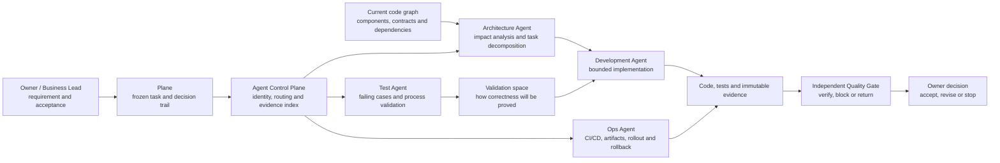
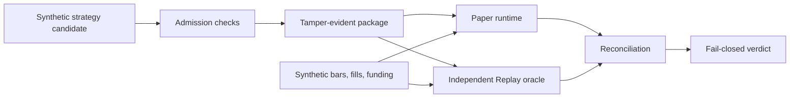

# QuantEngine Public: Multi-Agent Software Delivery Architecture

[](https://github.com/Derrickxxm/quantengine-public/actions/workflows/ci.yml)

QuantEngine Public presents the target architecture for a specialist
Native-Agent software delivery system. After the requirement and acceptance
criteria are frozen, a control plane coordinates Architecture, Test,
Development, and Ops Agents through identity-bound handoffs and independent
quality gates.

The intended result is a delivery system in which architecture impact is known
before implementation, validation is designed before code is accepted, Ops
prepares delivery from the beginning, every dependency remains traceable, and
no Agent can certify its own output.



## How The Specialist Agents Work

- **Architecture Agent** reads the frozen requirement and current code graph,
  identifies affected components and contracts, and decomposes the work into
  bounded implementation tasks.
- **Test Agent** turns acceptance criteria into failing tests and end-to-end
  process checks before implementation. Its first responsibility is to create
  the validation space: a concrete definition of how the system will prove the
  change correct and expose failure.
- **Development Agent** implements only inside the approved scope and contracts.
  It does not redefine the requirement or its own acceptance standard.
- **Ops Agent** prepares CI/CD, artifact identity, deployment checks, runtime
  readback, and rollback conditions from the beginning instead of joining after
  the code is finished.
- **Independent Quality Gate** verifies the bound tests and evidence. The Agent
  that produced a change cannot certify that same change for release.
- **Agent Control Plane** preserves task, repository, branch, commit, scope,
  test, and receipt identities across handoffs. It coordinates the work but does
  not replace the professional judgment owned by each specialist Agent.

The design keeps the model focused on the work it is good at - understanding,
reasoning, decomposition, implementation, and review - while deterministic
tools preserve facts that must not drift with chat context.

## The Four Control Mechanisms

The specialist Agents are only one part of the architecture. They remain safe
and useful because four control mechanisms connect their work:

1. **Fingerprints and lineage** - every important handoff preserves the exact
   task, source revision, configuration, data, candidate, package, runtime, and
   evidence identity it consumed. Downstream work follows producer-recorded
   identity edges instead of guessing from names, timestamps, or chat history.
2. **Fail-closed gates** - architecture scope, tests, package integrity,
   runtime parity, reconciliation, evidence completeness, and authority are
   checked at explicit boundaries. Missing or inconsistent facts stop the flow;
   they are not converted into a convenient PASS.
3. **Inspectable evidence** - tests, manifests, receipts, replay results,
   reconciliation, CI status, and release verdicts remain readable after the
   conversation ends. Code and runtime readback outrank summaries.
4. **The learning flywheel** - each cycle preserves the problem, failed path,
   reflection, decision, code change, negative evidence, and outcome. Plane,
   Git, the code graph, and immutable artifacts feed that learning into the next
   requirement instead of creating a static knowledge archive.

These mechanisms are not separate from the multi-Agent design. They are what
allow different Agents to work independently without losing the causal chain
between intent, implementation, verification, delivery, and learning.

## Native Agent, Skill, And Small CLI

The target architecture separates high-judgment workflow, variable execution,
deterministic checks, authoritative state, and durable evidence:

```text
high-judgment operating procedure  -> Skill
variable real-world execution      -> Native Agent
deterministic fact or safety check  -> small CLI / Tool
task and decision state             -> Plane / Git
durable run evidence                -> manifests / receipts / object storage
```

- **Skills** preserve the human-readable workflow, role boundaries, stop
  conditions, and review cadence. They tell an Agent how to operate without
  turning the procedure into another software platform.
- **Native Agents** handle work that changes with the repository, requirement,
  browser, runtime, and current evidence. They retain the model's ability to
  reason instead of forcing every branch into a command parser.
- **Small CLIs and tools** perform narrow deterministic operations: normalize an
  identity, read current state, run a declared test, verify a digest, record a
  receipt, or enforce a gate. They do not own the end-to-end workflow.
- **Chat memory is never the control plane.** Current task state and accepted
  decisions must be recoverable from authoritative systems and artifacts.

The complete module map, collaboration flow, public-version plan, and evidence
boundaries are documented in the
[Multi-Agent Public Architecture](docs/multi_agent_public_architecture.md).
The themes that future rewrites must preserve are frozen in the
[Public Showcase Content Contract](docs/public_showcase_content_contract.md),
with the current review recorded in the
[Three-Pass Review](docs/public_showcase_three_pass_review_20260826.md).
The first implementation milestone is the
[Public Golden Path](docs/public_golden_path_implementation_plan.md): one
synthetic requirement that crosses every role, gate, fingerprint, evidence, and
learning boundary before broader module expansion.

The next public edition is not intended to stop at the existing trading-engine
slice. It will add public-safe, synthetic equivalents of the LDA Control Plane,
`lda-agent-sdk`, Architecture Agent, Development Agent, Test Agent / Quality
Lab, Ops Agent, Quality Shield, QCS, evidence store, revision-bound code graph,
QuantLab, QuantStrategies, tick data, market causality, and Komodo runbook. Each
module must include runnable contracts, positive and negative cases,
inspectable evidence, and an explicit statement of what it cannot authorize.

## What Is Public In This Repository

The complete multi-Agent control system spans private repositories and runtime
environments. This repository now publishes two connected public-safe slices:

1. a software-delivery Golden Path with specialist-role handoffs, fingerprints,
   validation, Ops evidence, QCS evidence, independent quality, and AAR; and
2. a synthetic trading runtime that demonstrates package admission, Paper,
   independent Replay, reconciliation, and a fail-closed release verdict.

The runtime slice follows this evidence path:

```text
reviewed candidate -> admission -> sealed package -> Paper runtime
                   -> independent Replay -> reconciliation
                   -> fail-closed release verdict
```

The slice demonstrates the downstream part of the validation space: immutable
input identity, independent execution paths, negative tests, reconciliation,
explicit authority, and a verdict that stops when required evidence is missing.
It is not published to prove trading alpha or expose a profitable strategy.

This repository does **not** contain the private Agent Control Plane, real
strategies, exchange adapters, real orders, account data, production
configuration, credentials, or private deployment logic.

## If You Came From The Resume

Use the repository to verify the engineering claims instead of taking the
resume description on trust:

Recommended review path:

1. Read the [system context and public boundary](docs/ai_control_system_context.md).
2. Follow the [public showcase guide](docs/public_showcase_guide.md).
3. Inspect the committed [release verdict evidence](examples/showcase/release_verdict.json).
4. Review the negative cases in [the boundary tests](tests/test_demo_v2.py).
5. Run the synthetic demo and tests locally.

## Multi-Agent Golden Path

The first public Golden Path is implemented as a fixed synthetic demonstration.
It does not dispatch external Agents or grant production authority. It proves
that the handoff contracts, fingerprints, gates, evidence, and learning loop can
be reproduced and independently checked.

```text
OGSM -> Plane task -> Architecture packet -> Validation plan
     -> Worker handoff -> Patch manifest -> Test result -> Ops plan
     -> QCS manifest / receipt -> Quality verdict -> Release verdict -> AAR
```

Run it from a clean checkout:

```bash
.venv/bin/python -m quantengine_public.delivery.golden_path \
  --artifact-dir artifacts/public-golden-path
```

Review the committed evidence:

- [Reference request](examples/golden_path/reference_request.json)
- [Architecture packet](examples/golden_path/evidence/03_architecture_packet.json)
- [Validation plan](examples/golden_path/evidence/04_validation_plan.json)
- [QCS receipt](examples/golden_path/evidence/10_qcs_receipt.json)
- [Independent quality verdict](examples/golden_path/evidence/11_quality_verdict.json)
- [Release verdict](examples/golden_path/evidence/12_release_verdict.json)
- [Learning AAR](examples/golden_path/evidence/13_aar.json)
- [Nine request-bound fail-closed receipts](examples/golden_path/negative/)

The workflow meaning remains in four public Skills under [`skills/`](skills/).
The Python implementation only canonicalizes identities, evaluates closed gates,
verifies producer-owned dependency edges, and writes deterministic evidence; it
is not a replacement workflow platform.

## 60-Second Review

The engineering question is simple:

```text
Given the same sealed input, can Paper and an independent Replay prove the same economic state?
```



Current synthetic showcase result:

- Verdict: `PASS`
- Package id: `58f7123d64497761288c70a5f07a8ef6bce88f84eedd15e83b58600303fc0011`
- Paper authority: `true`
- Real authority: `false`
- Final equity: `9985.7`

Three fail-closed scenarios are tested:

- package tamper: changed, missing, or extra package files fail verification;
- input coverage gap: Replay missing an event fails reconciliation;
- economic mismatch: Paper and Replay cash/equity drift fails reconciliation.

Start here:

- [60-second walkthrough](docs/START_HERE.md)
- [Public showcase guide](docs/public_showcase_guide.md)
- [AI-assisted control system context](docs/ai_control_system_context.md)
- [Release verdict evidence](examples/showcase/release_verdict.json)
- [Reconciliation evidence](examples/showcase/reconciliation.json)
- [Package verification evidence](examples/showcase/package_verification.json)
- [Core implementation](src/quantengine_public/demo.py)
- [Boundary tests](tests/test_demo_v2.py)

## What It Demonstrates

1. Candidate admission produces explicit Paper and Real authority.
2. A release package is content-addressed and tamper-evident.
3. Paper and Replay are separate implementations sharing only contracts and input JSON.
4. Reconciliation compares decisions, ledger entries, positions, cash, fees, funding, equity, and input coverage.
5. Release verdict authority is derived from admission, package verification, reconciliation, and stress checks.

The point is not alpha. The point is backend control: identity, authority, replay, accounting, reconciliation, and release evidence.

## Run Locally

```bash
python -m venv .venv
.venv/bin/python -m pip install -e ".[dev]"
.venv/bin/python -m pytest
.venv/bin/quantengine-public demo-v2 --artifact-dir artifacts/demo-v2
```

The older v1 replay demo still exists for comparison:

```bash
.venv/bin/quantengine-public demo --artifact-dir artifacts/demo
.venv/bin/quantengine-public validate --artifact-dir artifacts/demo
```

## Repository Map

- `src/quantengine_public/demo.py`: public v2 Paper/Replay/reconciliation pipeline.
- `tests/test_demo_v2.py`: authority, package tamper, event validation, and mismatch tests.
- `examples/showcase/`: committed synthetic evidence viewable in GitHub.
- `examples/golden_path/`: committed multi-Agent handoff evidence and nine negative receipts.
- `skills/`: public Architecture, Test, Development, and Ops operating contracts.
- `contracts/public_delivery/`: versioned artifact envelope and Golden Path inventory.
- `src/quantengine_public/delivery/`: deterministic identity, gate, and evidence generator.
- `docs/START_HERE.md`: plain-language walkthrough for recruiters and engineers.
- `docs/public_showcase_guide.md`: resume-to-repository review path and capability map.
- `docs/ai_control_system_context.md`: public-safe context diagram for the larger AI-assisted control system.
- `docs/multi_agent_public_architecture.md`: complete specialist-Agent, provider, identity, gate, evidence, and flywheel architecture.
- `docs/public_showcase_content_contract.md`: non-deletion baseline for required public themes.
- `docs/public_showcase_three_pass_review_20260826.md`: objective, evidence-safety, and minimalism review record.
- `docs/public_golden_path_implementation_plan.md`: minimal end-to-end implementation sequence and acceptance criteria.
- `docs/v2_public_architecture_design.md`: design notes and public boundary.
- `SECURITY.md`: public content policy and safety scan.

## What This Project Does Not Include

- Real trading strategies or parameters.
- Exchange connectivity.
- Real orders, positions, balances, or account data.
- Production deployment scripts.
- Private paths, hosts, credentials, task data, or environment names.
