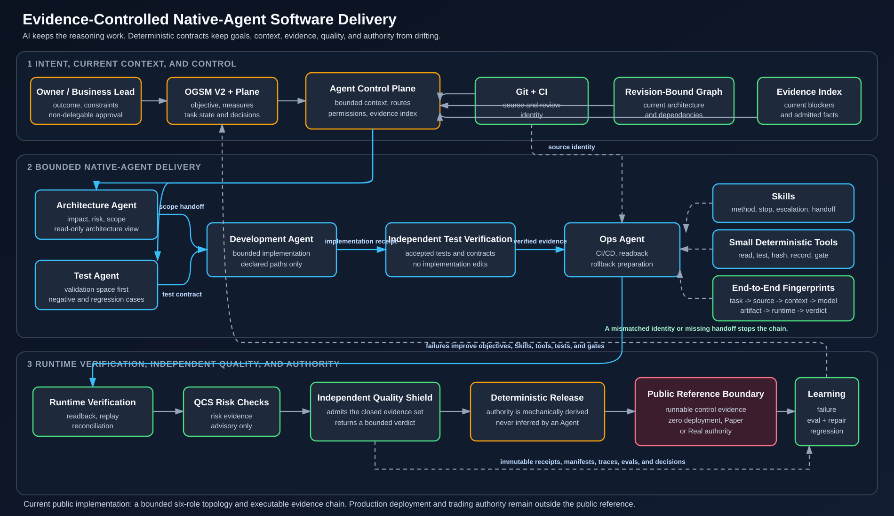
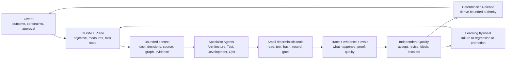
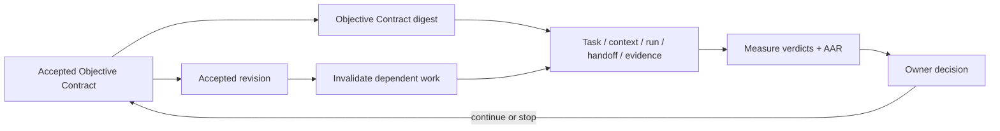

# Evidence-Controlled AI Software Delivery

[](https://github.com/Derrickxxm/evidence-controlled-ai-delivery/actions/workflows/ci.yml)



*System architecture and public reference boundary: accepted goals enter through OGSM V2 and Plane; bounded Architecture, Test, Development, and Ops roles operate through explicit handoffs; Git, revision-bound context, end-to-end fingerprints, runtime evidence, independent Quality, and deterministic Release keep the delivery chain traceable and fail closed. The implementation table below distinguishes runnable proof from experimental and planned adapters.*

## What This Repository Demonstrates

This repository answers one practical question:

> How can AI help deliver software without quietly changing the accepted goal,
> implementation scope, quality bar, evidence, or release authority?

The answer is not “add more Agents.” It is to keep model reasoning inside clear
responsibility boundaries and keep control facts outside the model:

- specialist Agents own bounded Architecture, Test, Development, and Ops work;
- Skills preserve judgment-heavy operating methods and stop conditions;
- small tools perform repeatable reads, hashes, state writes, and gates;
- exact task, source, context, model, artifact, and runtime identities remain
  connected through verifiable fingerprints;
- independent Quality evaluates admitted evidence, and a deterministic Release
  controller derives only the authority that evidence supports.

QuantEngine is the first runnable reference scenario. It provides a high-risk
financial setting in which identity, replay, reconciliation, and authority
cannot be treated as approximate. The architecture is broader than trading.

## Review It in Three Minutes

1. Read the architecture above from accepted objective to bounded authority.
2. Inspect the [14-artifact Golden Path](examples/golden_path/evidence/) and its
   [request-bound negative cases](examples/golden_path/negative/).
3. Open the [Native-Agent proof runner](scripts/native_agent_public_proof.py),
   its [adversarial verifier tests](tests/agent_platform/test_public_proof.py),
   and the [current role topology](docs/native_role_topology_dec0031.md).
4. Check the [CI workflow](.github/workflows/ci.yml), [public safety scan](scripts/public_safety_scan.py),
   and [release history](https://github.com/Derrickxxm/evidence-controlled-ai-delivery/releases).
5. Read the [public boundary](#public-boundary) before interpreting any runtime
   or authority claim.

## The Core Idea

```text
AI / Native Agent     -> understand, reason, decompose, implement, review
Skill                 -> preserve the operating method and stop conditions
Small Tool / CLI      -> read or write one deterministic fact, action, or gate
Plane / Git           -> own accepted goals, task state, decisions, and source
Evidence / Eval       -> prove what happened and whether the behavior was good
Independent Quality  -> judge the admitted evidence without certifying itself
Release Controller   -> mechanically derive only evidence-supported authority
Owner                -> approve business and risk decisions that cannot be inferred
```

Chat memory is never the control plane. Every task must be recoverable from
authoritative state and content-addressed evidence.

## What Is Actually Implemented

| Capability | What runs now | Where to verify it | Explicit boundary |
| --- | --- | --- | --- |
| Delivery contracts | A 14-artifact Golden Path plus request-bound negative paths | [`golden_path.py`](src/quantengine_public/delivery/golden_path.py), [positive evidence](examples/golden_path/evidence/), [negative evidence](examples/golden_path/negative/) | Deterministic regression harness; it does not call an external Agent |
| Native role topology | Architecture, Test author, Development, Test verify, Ops, and independent Quality receipts are admitted in one declared order | [`role_topology.py`](src/quantengine_public/agent_platform/role_topology.py), [topology tests](tests/agent_platform/test_role_topology.py), [DEC-0031](docs/native_role_topology_dec0031.md) | Recorded provider canaries plus a retained topology oracle; not one uninterrupted production run |
| SDK control proof | Six OpenAI Agents SDK roles, identity-bound handoffs, deterministic Release, and retained attack replay run in CI | [proof runner](scripts/native_agent_public_proof.py), [verifier tests](tests/agent_platform/test_public_proof.py), [CI](.github/workflows/ci.yml) | Uses a local `ScriptedModel`; it proves SDK and control integration, not hosted-model quality |
| Local-model experiment | A bounded OpenAI-compatible Qwen simulation and 24/24 repeatability run | [local receipt](docs/evidence/qwen_phase2_local_simulation_receipt_20260827.json), [acceptance summary](docs/evidence/qwen_phase2_overnight_acceptance_20260827.json) | Local Qwen only; no Hosted Luna, hosted-cost, write, Release, deployment, Replay, Paper, or Real claim |
| Hosted-model path | A digest-bound preflight and dry-run receipt remain fail closed | [`hosted_phase2.py`](src/quantengine_public/agent_platform/hosted_phase2.py), [runner tests](tests/test_hosted_phase2_runner.py) | No hosted request, token spend, tool, handoff, write, trace, or release authority is enabled by the dry run |
| QuantEngine reference | Synthetic admission, Paper, Replay, reconciliation, stress, recovery, and bounded release evidence | [60-second walkthrough](docs/START_HERE.md), [showcase evidence](examples/showcase/), [boundary tests](tests/test_demo_v2.py) | Demonstrates control semantics; it does not expose production code or prove trading alpha |

The table is the claim boundary. A design document may describe a larger target,
but a capability is presented as implemented only when this repository contains
code, tests, inspectable evidence, and an explicit statement of what it cannot
authorize.

<details>
<summary>Detailed implementation history, exact model lanes, and safety boundaries</summary>

### Current Native Execution Decision

TASKSYS-1329 / DEC-0031 is the current native execution topology:

```text
Architecture: gpt-5.6-terra (Codex CLI, ChatGPT subscription, read-only)
  -> Test author: gpt-5.6-sol (tests only)
  -> Development: qwen3.8:27b-mxfp8 (official Qwen Code, operator-local)
  -> Test verify: gpt-5.6-sol (read-only verification)
  -> Ops: deterministic local system
  -> Quality: existing quality_shield.observe_delivery system, advisory-only
  -> Release: deterministic controller, zero deployment/Paper/Real authority
```

Every receipt is bound to the accepted task, source identity, context digest,
execution HEAD, runtime/model, changed-path ownership, and the preceding
handoff digest. `derive_native_role_release()` revalidates the exact six-stage
chain before producing a content-addressed, zero-authority Release verdict.
The public contract itself pins `qwen3.8:27b-mxfp8` and includes the accepted
Development path allowlist in the topology digest; a caller cannot substitute
another local model or broaden the receipt's file scope.
Local Codex roles use ChatGPT subscription login and do not require an OpenAI
API key. The local Qwen lane uses a temporary loopback path to the operator-local model.
See [the DEC-0031 topology contract](docs/native_role_topology_dec0031.md).

The older `VerticalSliceRunner`, `ScriptedModel`, and all-Qwen Phase 2 material
below remains a network-free regression oracle and historical evidence. It is
not the accepted live provider topology and must not be presented as one.

The runnable repository now contains the deterministic 14-artifact Golden Path,
the synthetic QuantEngine reference runtime, one bounded scripted Native-Agent
vertical slice, and a separate loopback-only local-Qwen Phase 2 proof backed by
OpenAI Agents SDK 0.22.0. These slices prove local control contracts; they do
not claim a production platform, deployment, Paper, Replay, or Real authority.

The approved MVP route reuses the MIT OpenAI Agents SDK for Python for Agent
execution, Agent-as-tool, handoffs, SQLite sessions, interruption/resume,
approvals, and tracing. Repository-owned implementation will remain limited to
task/source/context identity, deterministic role transitions, cross-run
handoff receipts, evidence admission, independent Quality, and Release
authority. Owner-authorized implementation steps 1-6 were merged by PR #5;
TASKSYS-1264 adds the deterministic learning closure: seven retained Release
attacks, repair-layer and red-test receipts, an independent promotion review,
and a content-addressed zero-authority AAR. TASKSYS-1266 adds the bounded M8 CI
proof: six real SDK role runs, six identity-bound handoffs, exact-topology
Release, M7 replay, and a public-safe receipt trace that can be reverified from
bytes. The model remains a local ScriptedModel, so no prompt, API key, hosted
trace, or network model call enters the proof. Deployment, QuantEngine Replay,
Paper, and Real remain outside scope.

Phase 2 begins with TASKSYS-1317's fail-closed hosted-model canary preflight.
It binds the task revision, source, context, Agent graph, model, turn limit,
output-token limit, timeout, trace mode, evidence mode, tool count, and handoff
count into a content digest, then emits a public-safe `BLOCKED` receipt. The
preflight deliberately has no environment or network access and cannot enable
hosted tracing, tools, handoffs, raw evidence, or model execution. Selecting a
real model, reading a key, spending tokens, and making the first hosted request
remain separate Owner approval boundaries.

DEC-0018 adds a separate private-workstation local-model simulation without
weakening that boundary. DEC-0019 hardens the isolated `qwen3.8:27b-mxfp8`
track with a canonical endpoint digest, bounded discovery and whole-run
deadlines, one repair budget for the entire development stage, usage ceilings,
and independently rederivable role and handoff identity receipts. The retained
run uses the Agents SDK through an ephemeral loopback connection for one
Architecture run, exact read-only source lookup, Architecture-to-Test handoff,
and a four-role Architecture/Test/Development/Quality loop. Its digest-only
[receipt](docs/evidence/qwen_phase2_local_simulation_receipt_20260827.json)
explicitly states `hosted_luna_proof=false`, zero hosted cost, no hosted claim,
and no write, Release, deployment, or QuantEngine runtime authority. It is not
evidence that `gpt-5.6-luna` or OpenAI API authentication was exercised.

Release `v0.5.2` also publishes the public-safe
[overnight acceptance summary](docs/evidence/qwen_phase2_overnight_acceptance_20260827.json)
for the reviewed source revision: 24 of 24 bounded full-chain runs and all
three adversarial suites passed. That repeatability evidence remains local
Qwen evidence and grants no Hosted Luna, hosted-cost, write, Release,
deployment, Replay, Paper, or Real claim.

</details>

## The Delivery Control Loop



The control plane coordinates identity, state, routing, and evidence. It does
not replace specialist judgment and cannot turn missing evidence into PASS.

## Public OGSM V2: Objective-Bound Golden Path

Golden Path v1 remains the original 14-artifact, request-bound delivery
harness. Golden Path V2 is a separate, domain-neutral extension: it starts only
after an Owner has accepted an Objective Contract, carries that contract's
digest through delivery, evaluates declared Measures, records the AAR and
Owner decision, and fails closed when an accepted revision makes dependent
work stale. V1 remains unchanged and reproducible; V2 does not upgrade or
reinterpret v1 evidence.



The committed local [V2 proof](examples/golden_path_v2/proof.json) contains
16 logical sections, eight positive delivery artifacts, and 14 typed attacks. Its
independently recomputed proof digest is
`f06df976a6b5ce850f55c1d3660ee9369832f35fefebf7e6b6a265a63738c123`.
Its execution mode is `deterministic-domain-neutral-fixture`; it made no
network model call and every authority field is false.

| Presentation boundary | Current evidence |
| --- | --- |
| Local deterministic proof and tests | PASS through M5; M6A documents that evidence |
| Remote CI | M6B PASS on [PR run 33140279809](https://github.com/Derrickxxm/evidence-controlled-ai-delivery/actions/runs/33140279809), Python 3.11 and 3.14 |
| Push, pull request, and public branch | M6B COMPLETE on PR #17 at reviewed head `c0da831e8cd05faf7386157879129c759e4dc95c` |
| Merge, tag, and GitHub Release | M6C Owner-authorized for the `v0.6.0` release candidate; exact-head CI and post-merge readback remain mandatory |
| Deployment or runtime authority | zero authority; no network model, deployment, or QuantEngine Research, Paper, Replay, or Real action |

M6B proves the reviewed PR head and its merge with then-current main. M6C may
publish `v0.6.0` only after the final release-candidate head passes the same
checks and the merged main identity is read back. A repository tag or GitHub
Release never converts this synthetic proof into production runtime authority.

## Responsibility Boundaries

| Layer | Owns | Must not own |
| --- | --- | --- |
| Native Agent | current-context reasoning and variable execution | authoritative facts or implicit permission |
| Skill | workflow, role, evidence, stop, and escalation rules | mutable business state or an end-to-end software platform |
| Small Tool / CLI | one repeatable read, action, validation, or state write | workflow judgment |
| Plane / Git | accepted objective, task, decision, source, and review history | inferred runtime truth |
| Trace | what the Agent and tools actually did | release authority |
| Evidence | facts supporting a result | behavioral quality by itself |
| Eval | whether Agent behavior and output met the declared standard | production permission |
| Independent Quality | evidence admission and bounded verdict | creating the evidence it certifies or granting runtime authority |
| Release Controller | mechanically derived, evidence-supported authority | reinterpreting missing evidence or replacing Owner approval |
| Owner | non-delegable business and risk decisions | fabricated technical evidence |

## When A Separate Agent Is Justified

Start with one Agent and tools. Split a specialist only when at least one of the
following requires a separate boundary:

- different instructions or professional responsibility;
- different tools, data, or permissions;
- different context and success criteria;
- formal transfer of task ownership;
- independent review that the producer must not perform itself.

The architecture supports three explicit collaboration modes:

1. **Agent as tool** - the coordinating Agent keeps ownership and requests one
   bounded specialist result.
2. **Handoff** - ownership transfers through an identity-bound receipt and an
   allowed state transition.
3. **Independent review** - the reviewer never takes over implementation; it
   returns a bounded PASS, BLOCK, or REVISION_REQUIRED verdict.

## Specialist Delivery Roles

- **Architecture Agent** combines the frozen requirement with the current,
  revision-bound code graph. It identifies affected contracts, risks, allowed
  paths, and bounded work packets.
- **Test Agent** establishes the validation space before implementation: success
  cases, failing regression tests, negative cases, process checks, and expected
  evidence.
- **Development Agent** changes only approved scope. It cannot redefine the
  objective, weaken tests, or certify its own work.
- **Ops Agent** prepares CI/CD, artifact identity, runtime readback, rollback,
  and delivery evidence from the beginning.
- **Quality Shield** independently evaluates the complete evidence set,
  including runtime evidence. It grants no runtime authority.
- **Release Controller** is deterministic. It derives bounded authority only
  from an admitted Quality verdict and the exact runtime evidence that verdict
  consumed.

The detailed orchestration, state machine, trust boundaries, context assembly,
module plan, and domain example are in the
[Multi-Agent Public Architecture](docs/multi_agent_public_architecture.md).

## Four Controls Against Drift

1. **Fingerprints and lineage** - every producer records the exact upstream
   task, source revision, configuration, package, runtime, and evidence identity
   it consumed. Similar names, timestamps, or prose cannot create an edge.
2. **Fail-closed gates** - unknown, missing, stale, skipped, or inconsistent
   facts remain blocked. Compatibility cannot silently weaken safety semantics.
3. **Inspectable evidence** - tests, manifests, receipts, runtime readback,
   reconciliation, and release decisions remain reviewable after the Agent
   session ends.
4. **Learning flywheel** - a failure becomes an eval or regression case, changes
   the correct Skill, Tool, Contract, Model, Data, or Process layer, and must pass
   historical failures before the new baseline is promoted.

## What Is Runnable Today

The repository publishes two connected, public-safe slices.

### 1. Software-Delivery Golden Path

A fixed synthetic change crosses the complete control path:

```text
OGSM -> Plane task -> Architecture packet -> Validation plan
     -> Worker handoff -> Patch manifest -> Test result -> Ops plan
     -> Runtime evidence -> QCS manifest / receipt
     -> Quality verdict -> Release verdict -> AAR
```

The result is 14 connected artifacts. Nine request-bound negative scenarios
stop at the role that owns the missing or inconsistent fact.

This harness does **not** dispatch external Agents. It proves the public
contracts, fingerprints, artifact progression, producer ownership, fail-closed
gates, evidence order, and authority boundary that a real Agent runtime must
obey.

Review the evidence:

- [Reference request](examples/golden_path/reference_request.json)
- [Architecture packet](examples/golden_path/evidence/03_architecture_packet.json)
- [Validation plan](examples/golden_path/evidence/04_validation_plan.json)
- [Runtime evidence](examples/golden_path/evidence/09_runtime_evidence.json)
- [Independent quality verdict](examples/golden_path/evidence/12_quality_verdict.json)
- [Release verdict](examples/golden_path/evidence/13_release_verdict.json)
- [Learning AAR](examples/golden_path/evidence/14_aar.json)
- [Nine request-bound fail-closed receipts](examples/golden_path/negative/)

The operating methods remain readable in four public Skills under
[`skills/`](skills/). Python only implements deterministic identity, evidence,
gate, and reproduction mechanics; it is not a replacement workflow platform.

### 2. QuantEngine Reference Scenario

QuantEngine demonstrates why these controls matter in a high-risk financial
runtime where package identity, execution history, accounting, and authority
must be exact:

```text
reviewed candidate -> admission -> sealed package
                   -> synthetic Paper + independent Replay
                   -> reconciliation -> runtime evidence
                   -> independent quality -> bounded release authority
```

The current synthetic result is:

- runtime verdict: `PASS`;
- package id: `58f7123d64497761288c70a5f07a8ef6bce88f84eedd15e83b58600303fc0011`;
- synthetic Paper authority inside the committed reference artifact: `true`;
- Real authority: `false`;
- final synthetic equity: `9985.7`.

The reference scenario tests package tampering, missing input coverage, economic
state mismatch, reconciliation, stress, and recovery. It does not prove trading
alpha, expose a profitable strategy, or grant permission to deploy or operate a
real Paper or Real environment.

Start with:

- [60-second runtime walkthrough](docs/START_HERE.md)
- [Public showcase guide](docs/public_showcase_guide.md)
- [System context and public boundary](docs/ai_control_system_context.md)
- [Runtime release evidence](examples/showcase/release_verdict.json)
- [Boundary tests](tests/test_demo_v2.py)

## Dynamic Context, Not A Static Knowledge Dump

Each Agent turn should assemble only the facts required for the current work:

```text
accepted task and decisions
+ current source revision
+ revision-bound dependency graph
+ current blockers and evidence
+ directly related historical regressions and AAR index
= bounded working context
```

Plane preserves intent. Git preserves implementation history. The code graph
exposes current architecture. Evidence records what actually ran. A small
identity index connects them without asking the model to trust a large static
prose archive.

## Current And Planned Scope

Implemented and runnable here:

- the 14-artifact software-delivery Golden Path;
- versioned artifact and producer contracts;
- four public Skills;
- a thin, evidence-gated control state with identity-bound handoffs and restart recovery;
- an OpenAI Agents SDK 0.22.0 adapter with bounded tools, durable RunState envelopes, and local traces;
- one network-free Architecture → Test → Development → Test → Ops → independent Quality → deterministic Release slice;
- a zero-network, digest-only hosted-model canary preflight that keeps execution blocked;
- a local OpenAI-compatible Agents SDK simulation with an exact read-only tool,
  one handoff, four identity-ordered roles, and an explicit non-hosted receipt;
- request-bound negative evidence;
- QuantEngine admission, package verification, synthetic Paper, independent
  Replay, reconciliation, stress, recovery, and release evidence;
- CI verification and public-content safety scanning.

Planned public-safe equivalents include a revision-bound code-graph adapter,
deeper Quality Lab and QCS integration, an evidence store, QuantLab,
QuantStrategies, tick data, market causality, and Komodo runbook. A planned
component is not presented as implemented until it
has code, tests, example evidence, and an explicit authority boundary.

For the MVP, "Agent SDK" means a thin adapter around
[OpenAI Agents SDK Python](https://github.com/openai/openai-agents-python), not
a new repository-owned Agent framework.

## Run Locally

```bash
python -m venv .venv
.venv/bin/python -m pip install -e ".[dev]"
.venv/bin/python -m pytest
.venv/bin/python -m quantengine_public.delivery.golden_path \
  --artifact-dir artifacts/public-golden-path
.venv/bin/quantengine-public demo-v2 --artifact-dir artifacts/demo-v2
```

## Repository Map

- `skills/`: high-judgment Architecture, Test, Development, and Ops contracts.
- `contracts/public_delivery/`: versioned evidence and producer contracts.
- `src/quantengine_public/delivery/`: deterministic Golden Path mechanics.
- `examples/golden_path/`: positive chain and request-bound negative receipts.
- `src/quantengine_public/demo.py`: QuantEngine Paper/Replay reference runtime.
- `examples/showcase/`: committed runtime evidence.
- `tests/`: contract, failure, authority, runtime, and evidence tests.
- `docs/multi_agent_public_architecture.md`: layered target architecture.
- `docs/native_agent_multi_agent_platform_mvp_design_20260826.md`: approved
  reuse-first MVP boundary and implementation gate.
- `docs/public_showcase_content_contract.md`: required public themes.
- `docs/public_golden_path_implementation_plan.md`: thin implementation plan.
- `SECURITY.md`: public-content boundary and scan policy.

## Public Boundary

This repository does not contain private Agent prompts, private control-plane
code, real strategies, exchange adapters, real orders, account data,
credentials, production configuration, signing secrets, or private deployment
logic.

The public content contract, positive and negative evidence, CI, and safety scan
exist so a reviewer can distinguish what is implemented, synthetic, planned,
and withheld.
