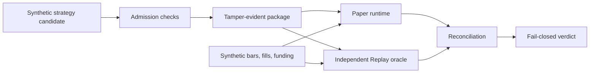

# QuantEngine Public Edition

[](https://github.com/Derrickxxm/quantengine-public/actions/workflows/ci.yml)

QuantEngine Public Edition is a public-safe backend verification slice from a larger quantitative trading system. It uses only synthetic data to show strategy admission, tamper-evident package identity, Paper runtime evidence, independent Replay evidence, reconciliation, and fail-closed release gates.

This repository does not contain real strategies, exchange adapters, real orders, account data, production configuration, or private deployment logic.

## 60-Second Review

The engineering question is simple:

```text
Given the same sealed input, can Paper and an independent Replay prove the same economic state?
```



Current synthetic showcase result:

- Verdict: `PASS`
- Package id: `58f7123d64497761288c70a5f07a8ef6bce88f84eedd15e83b58600303fc0011`
- Paper authority: `true`
- Real authority: `false`
- Final equity: `9985.7`

Three fail-closed scenarios are tested:

- package tamper: changed, missing, or extra package files fail verification;
- input coverage gap: Replay missing an event fails reconciliation;
- economic mismatch: Paper and Replay cash/equity drift fails reconciliation.

Start here:

- [60-second walkthrough](docs/START_HERE.md)
- [Release verdict evidence](examples/showcase/release_verdict.json)
- [Reconciliation evidence](examples/showcase/reconciliation.json)
- [Package verification evidence](examples/showcase/package_verification.json)
- [Core implementation](src/quantengine_public/demo.py)
- [Boundary tests](tests/test_demo_v2.py)

## What It Demonstrates

1. Candidate admission produces explicit Paper and Real authority.
2. A release package is content-addressed and tamper-evident.
3. Paper and Replay are separate implementations sharing only contracts and input JSON.
4. Reconciliation compares decisions, ledger entries, positions, cash, fees, funding, equity, and input coverage.
5. Release verdict authority is derived from admission, package verification, reconciliation, and stress checks.

The point is not alpha. The point is backend control: identity, authority, replay, accounting, reconciliation, and release evidence.

## Run Locally

```bash
python -m venv .venv
.venv/bin/python -m pip install -e ".[dev]"
.venv/bin/python -m pytest
.venv/bin/quantengine-public demo-v2 --artifact-dir artifacts/demo-v2
```

The older v1 replay demo still exists for comparison:

```bash
.venv/bin/quantengine-public demo --artifact-dir artifacts/demo
.venv/bin/quantengine-public validate --artifact-dir artifacts/demo
```

## Repository Map

- `src/quantengine_public/demo.py`: public v2 Paper/Replay/reconciliation pipeline.
- `tests/test_demo_v2.py`: authority, package tamper, event validation, and mismatch tests.
- `examples/showcase/`: committed synthetic evidence viewable in GitHub.
- `docs/START_HERE.md`: plain-language walkthrough for recruiters and engineers.
- `docs/v2_public_architecture_design.md`: design notes and public boundary.
- `SECURITY.md`: public content policy and safety scan.

## What This Project Does Not Include

- Real trading strategies or parameters.
- Exchange connectivity.
- Real orders, positions, balances, or account data.
- Production deployment scripts.
- Private paths, hosts, credentials, task data, or environment names.
