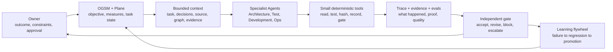

# Evidence-Controlled AI Software Delivery

[](https://github.com/Derrickxxm/quantengine-public/actions/workflows/ci.yml)

QuantEngine is the first runnable reference implementation of a broader idea:
let AI retain its ability to reason, while goals, state, dependencies,
permissions, validation, and evidence remain deterministic and inspectable.

This is not a framework for adding more Agents to every task. It is a software
delivery control architecture for preventing long-running AI-assisted work from
drifting away from the accepted objective, current code, quality bar, runtime,
or evidence.

## The Core Idea

```text
AI / Native Agent     -> understand, reason, decompose, implement, review
Skill                 -> preserve the operating method and stop conditions
Small Tool / CLI      -> read or write one deterministic fact, action, or gate
Plane / Git           -> own accepted goals, task state, decisions, and source
Evidence / Eval       -> prove what happened and whether the behavior was good
Human / Release Gate  -> approve decisions that must not be inferred
```

Chat memory is never the control plane. Every task must be recoverable from
authoritative state and content-addressed evidence.

## Current Implementation Decision

The runnable repository now contains the deterministic 14-artifact Golden Path,
the synthetic QuantEngine reference runtime, and one bounded Native-Agent
vertical slice backed by OpenAI Agents SDK 0.22.0. The slice uses scripted,
network-free model responses and proves local control contracts; it does not
claim a production platform, deployment, Paper, Replay, or Real authority.

The approved MVP route reuses the MIT OpenAI Agents SDK for Python for Agent
execution, Agent-as-tool, handoffs, SQLite sessions, interruption/resume,
approvals, and tracing. Repository-owned implementation will remain limited to
task/source/context identity, deterministic role transitions, cross-run
handoff receipts, evidence admission, independent Quality, and Release
authority. Owner-authorized implementation steps 1-6 were merged by PR #5;
TASKSYS-1264 adds the deterministic learning closure: seven retained Release
attacks, repair-layer and red-test receipts, an independent promotion review,
and a content-addressed zero-authority AAR. Public proof/re-review, graph
refresh, deployment, QuantEngine Replay, Paper, and Real remain outside scope.

## The Delivery Control Loop



The control plane coordinates identity, state, routing, and evidence. It does
not replace specialist judgment and cannot turn missing evidence into PASS.

## Responsibility Boundaries

| Layer | Owns | Must not own |
| --- | --- | --- |
| Native Agent | current-context reasoning and variable execution | authoritative facts or implicit permission |
| Skill | workflow, role, evidence, stop, and escalation rules | mutable business state or an end-to-end software platform |
| Small Tool / CLI | one repeatable read, action, validation, or state write | workflow judgment |
| Plane / Git | accepted objective, task, decision, source, and review history | inferred runtime truth |
| Trace | what the Agent and tools actually did | release authority |
| Evidence | facts supporting a result | behavioral quality by itself |
| Eval | whether Agent behavior and output met the declared standard | production permission |
| Independent Gate | evidence admission and bounded verdict | creating the evidence it certifies |
| Owner | non-delegable business and risk decisions | fabricated technical evidence |

## When A Separate Agent Is Justified

Start with one Agent and tools. Split a specialist only when at least one of the
following requires a separate boundary:

- different instructions or professional responsibility;
- different tools, data, or permissions;
- different context and success criteria;
- formal transfer of task ownership;
- independent review that the producer must not perform itself.

The architecture supports three explicit collaboration modes:

1. **Agent as tool** - the coordinating Agent keeps ownership and requests one
   bounded specialist result.
2. **Handoff** - ownership transfers through an identity-bound receipt and an
   allowed state transition.
3. **Independent review** - the reviewer never takes over implementation; it
   returns a bounded PASS, BLOCK, or REVISION_REQUIRED verdict.

## Specialist Delivery Roles

- **Architecture Agent** combines the frozen requirement with the current,
  revision-bound code graph. It identifies affected contracts, risks, allowed
  paths, and bounded work packets.
- **Test Agent** establishes the validation space before implementation: success
  cases, failing regression tests, negative cases, process checks, and expected
  evidence.
- **Development Agent** changes only approved scope. It cannot redefine the
  objective, weaken tests, or certify its own work.
- **Ops Agent** prepares CI/CD, artifact identity, runtime readback, rollback,
  and delivery evidence from the beginning.
- **Quality Shield** independently evaluates the complete evidence set,
  including runtime evidence. It grants no runtime authority.
- **Release Controller** is deterministic. It derives bounded authority only
  from an admitted Quality verdict and the exact runtime evidence that verdict
  consumed.

The detailed orchestration, state machine, trust boundaries, context assembly,
module plan, and domain example are in the
[Multi-Agent Public Architecture](docs/multi_agent_public_architecture.md).

## Four Controls Against Drift

1. **Fingerprints and lineage** - every producer records the exact upstream
   task, source revision, configuration, package, runtime, and evidence identity
   it consumed. Similar names, timestamps, or prose cannot create an edge.
2. **Fail-closed gates** - unknown, missing, stale, skipped, or inconsistent
   facts remain blocked. Compatibility cannot silently weaken safety semantics.
3. **Inspectable evidence** - tests, manifests, receipts, runtime readback,
   reconciliation, and release decisions remain reviewable after the Agent
   session ends.
4. **Learning flywheel** - a failure becomes an eval or regression case, changes
   the correct Skill, Tool, Contract, Model, Data, or Process layer, and must pass
   historical failures before the new baseline is promoted.

## What Is Runnable Today

The repository publishes two connected, public-safe slices.

### 1. Software-Delivery Golden Path

A fixed synthetic change crosses the complete control path:

```text
OGSM -> Plane task -> Architecture packet -> Validation plan
     -> Worker handoff -> Patch manifest -> Test result -> Ops plan
     -> Runtime evidence -> QCS manifest / receipt
     -> Quality verdict -> Release verdict -> AAR
```

The result is 14 connected artifacts. Nine request-bound negative scenarios
stop at the role that owns the missing or inconsistent fact.

This harness does **not** dispatch external Agents. It proves the public
contracts, fingerprints, artifact progression, producer ownership, fail-closed
gates, evidence order, and authority boundary that a real Agent runtime must
obey.

Review the evidence:

- [Reference request](examples/golden_path/reference_request.json)
- [Architecture packet](examples/golden_path/evidence/03_architecture_packet.json)
- [Validation plan](examples/golden_path/evidence/04_validation_plan.json)
- [Runtime evidence](examples/golden_path/evidence/09_runtime_evidence.json)
- [Independent quality verdict](examples/golden_path/evidence/12_quality_verdict.json)
- [Release verdict](examples/golden_path/evidence/13_release_verdict.json)
- [Learning AAR](examples/golden_path/evidence/14_aar.json)
- [Nine request-bound fail-closed receipts](examples/golden_path/negative/)

The operating methods remain readable in four public Skills under
[`skills/`](skills/). Python only implements deterministic identity, evidence,
gate, and reproduction mechanics; it is not a replacement workflow platform.

### 2. QuantEngine Reference Scenario

QuantEngine demonstrates why these controls matter in a high-risk financial
runtime where package identity, execution history, accounting, and authority
must be exact:

```text
reviewed candidate -> admission -> sealed package
                   -> synthetic Paper + independent Replay
                   -> reconciliation -> runtime evidence
                   -> independent quality -> bounded release authority
```

The current synthetic result is:

- runtime verdict: `PASS`;
- package id: `58f7123d64497761288c70a5f07a8ef6bce88f84eedd15e83b58600303fc0011`;
- Paper authority after independent release control: `true`;
- Real authority: `false`;
- final synthetic equity: `9985.7`.

The reference scenario tests package tampering, missing input coverage, economic
state mismatch, reconciliation, stress, and recovery. It does not prove trading
alpha or expose a profitable strategy.

Start with:

- [60-second runtime walkthrough](docs/START_HERE.md)
- [Public showcase guide](docs/public_showcase_guide.md)
- [System context and public boundary](docs/ai_control_system_context.md)
- [Runtime release evidence](examples/showcase/release_verdict.json)
- [Boundary tests](tests/test_demo_v2.py)

## Dynamic Context, Not A Static Knowledge Dump

Each Agent turn should assemble only the facts required for the current work:

```text
accepted task and decisions
+ current source revision
+ revision-bound dependency graph
+ current blockers and evidence
+ directly related historical regressions and AAR index
= bounded working context
```

Plane preserves intent. Git preserves implementation history. The code graph
exposes current architecture. Evidence records what actually ran. A small
identity index connects them without asking the model to trust a large static
prose archive.

## Current And Planned Scope

Implemented and runnable here:

- the 14-artifact software-delivery Golden Path;
- versioned artifact and producer contracts;
- four public Skills;
- a thin, evidence-gated control state with identity-bound handoffs and restart recovery;
- an OpenAI Agents SDK 0.22.0 adapter with bounded tools, durable RunState envelopes, and local traces;
- one network-free Architecture → Test → Development → Test → Ops → independent Quality → deterministic Release slice;
- request-bound negative evidence;
- QuantEngine admission, package verification, synthetic Paper, independent
  Replay, reconciliation, stress, recovery, and release evidence;
- CI verification and public-content safety scanning.

Planned public-safe equivalents include a revision-bound code-graph adapter,
deeper Quality Lab and QCS integration, an evidence store, QuantLab,
QuantStrategies, tick data, market causality, and Komodo runbook. A planned
component is not presented as implemented until it
has code, tests, example evidence, and an explicit authority boundary.

For the MVP, "Agent SDK" means a thin adapter around
[OpenAI Agents SDK Python](https://github.com/openai/openai-agents-python), not
a new repository-owned Agent framework.

## Run Locally

```bash
python -m venv .venv
.venv/bin/python -m pip install -e ".[dev]"
.venv/bin/python -m pytest
.venv/bin/python -m quantengine_public.delivery.golden_path \
  --artifact-dir artifacts/public-golden-path
.venv/bin/quantengine-public demo-v2 --artifact-dir artifacts/demo-v2
```

## Repository Map

- `skills/`: high-judgment Architecture, Test, Development, and Ops contracts.
- `contracts/public_delivery/`: versioned evidence and producer contracts.
- `src/quantengine_public/delivery/`: deterministic Golden Path mechanics.
- `examples/golden_path/`: positive chain and request-bound negative receipts.
- `src/quantengine_public/demo.py`: QuantEngine Paper/Replay reference runtime.
- `examples/showcase/`: committed runtime evidence.
- `tests/`: contract, failure, authority, runtime, and evidence tests.
- `docs/multi_agent_public_architecture.md`: layered target architecture.
- `docs/native_agent_multi_agent_platform_mvp_design_20260826.md`: approved
  reuse-first MVP boundary and implementation gate.
- `docs/public_showcase_content_contract.md`: required public themes.
- `docs/public_golden_path_implementation_plan.md`: thin implementation plan.
- `SECURITY.md`: public-content boundary and scan policy.

## Public Boundary

This repository does not contain private Agent prompts, private control-plane
code, real strategies, exchange adapters, real orders, account data,
credentials, production configuration, signing secrets, or private deployment
logic.

The public content contract, positive and negative evidence, CI, and safety scan
exist so a reviewer can distinguish what is implemented, synthetic, planned,
and withheld.
