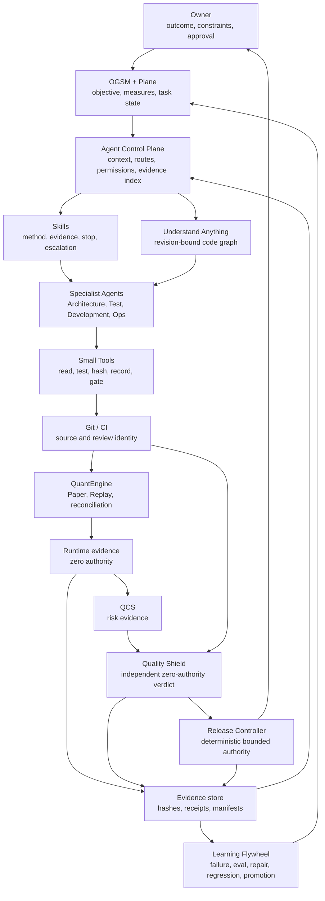

# Evidence-Controlled AI System Context

QuantEngine Public is the first runnable reference implementation of a larger AI
software delivery control architecture. The public repository shows two
connected slices without exposing private prompts, strategies, accounts,
credentials, hosts, or deployment logic:

1. a 14-artifact software-delivery Golden Path; and
2. a synthetic QuantEngine Paper / Replay / reconciliation runtime.

The system exists to keep long-running AI-assisted work aligned with the
accepted task, current source, quality bar, runtime evidence, and allowed
authority.

## Public-Safe Context



The arrows do not grant authority. Every transition requires an allowed state,
matching identities, admitted evidence, an authorized producer, and an explicit
next owner.

## What Each Boundary Prevents

| Boundary | Owns | Drift prevented |
| --- | --- | --- |
| OGSM / Plane | objective, measures, state, decisions | goal and acceptance drift |
| Agent Control Plane | context, routing, permissions, evidence index | hidden ownership and authority changes |
| Skill | human-readable operating procedure | heavy CLI becoming a second platform |
| Git / CI | source and review identity | implementation-history drift |
| Revision-bound graph | current components and dependencies | stale architectural understanding |
| Runtime evidence | actual package, execution, replay, accounting, readback | plausible stories replacing runtime facts |
| QCS | selected risk surfaces and advisory evidence | local green tests hiding risk gaps |
| Quality Shield | independent evidence admission | producer self-certification |
| Release Controller | deterministic bounded authority | a producer granting permission from its own result |
| Evidence store | manifests, receipts, traces, evals, decisions | evidence disappearing or being silently replaced |

## Identity And Context

Every producer answers:

1. What exact upstream artifact did it consume?
2. What exact output did it produce?
3. Which downstream result relied on that output?

The public implementation binds task, source, artifact, package, runtime,
quality, and release identities with canonical SHA-256 digests. A digest edge
must resolve to the declared artifact type and producer.

Each Agent run should receive a bounded context assembled from:

```text
accepted task and decisions
+ current source revision
+ revision-bound graph
+ role Skill and allowed tools
+ current blockers and evidence
+ directly related regression and AAR index
```

A stale graph or mismatched source blocks the run. Chat memory is not a fallback
source of authority.

## Trace, Evidence, Eval, And Authority

- **Trace** records what the Agent, model, tools, guardrails, and handoffs did.
- **Evidence** records the facts supporting a result.
- **Eval** judges behavior or output against an accepted standard.
- **Authority** states which action is allowed next.

These records may reference each other but remain separate. A trace is not proof
of correctness, evidence is not permission, and an eval cannot invent runtime
facts.

## QuantEngine Reference Path

```text
reviewed candidate
  -> admission
  -> tamper-evident package
  -> synthetic Paper + independent Replay
  -> reconciliation, stress, recovery
  -> zero-authority runtime evidence
  -> QCS risk evidence
  -> independent Quality Shield
  -> deterministic bounded Paper authority
```

The reference scenario makes lineage and authority failures visible. It does not
prove strategy profitability and grants no Real or production authority.

## Learning Instead Of Static Accumulation

The system does not improve by accumulating a large prose archive. It preserves
a small identity graph over changing authoritative facts:

```text
failure evidence
  -> reflection and Owner decision
  -> new eval or regression
  -> Skill / Tool / Contract / Model / Data / Process repair
  -> historical replay
  -> independent review
  -> accepted baseline promotion
```

Plane preserves why. Git preserves what changed. The graph shows what is
currently connected. Evidence proves what ran. Evals prevent known failures
from returning.

## Public Boundary

The public repository does not include the private control plane, private Agent
prompts, production object-store configuration, Komodo configuration, private
research repositories, real strategies, exchange adapters, credentials, real
orders, account data, or deployment logic.

To inspect the public capability:

1. read the [README](../README.md);
2. follow the [Golden Path plan](public_golden_path_implementation_plan.md);
3. inspect the [runtime evidence](../examples/golden_path/evidence/09_runtime_evidence.json);
4. inspect the [independent quality verdict](../examples/golden_path/evidence/12_quality_verdict.json);
5. review the [negative evidence](../examples/golden_path/negative/);
6. run the repository tests.
