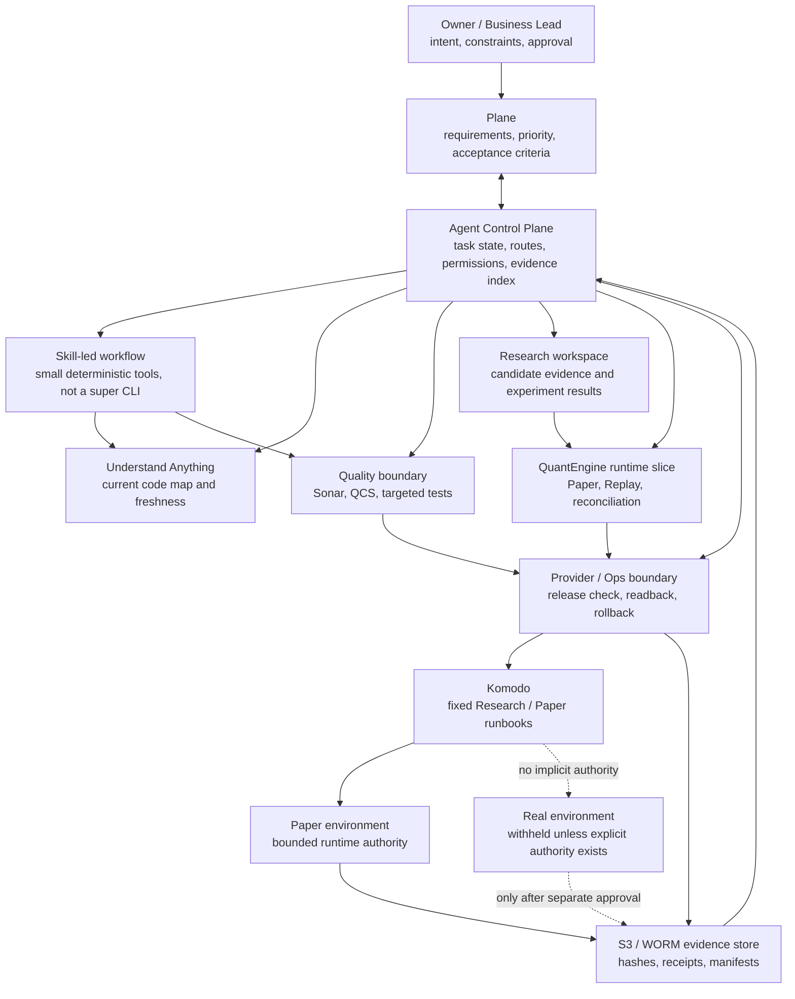

# AI-Assisted Control System Context

QuantEngine Public Edition is a runnable public slice of a larger engineering
control system. This page shows the system context behind the slice without
exposing private strategies, account data, hosts, credentials, or production
deployment logic.

The public repository implements the synthetic Paper / Replay / reconciliation
loop. The surrounding control system exists to keep long-running AI-assisted
delivery from drifting away from the task, code, runtime, quality bar, and
evidence.

## Public-Safe Context Diagram



## What Each Boundary Prevents

| Boundary | Owns | Drift it prevents |
| --- | --- | --- |
| Plane | Task intent, priority, state, approval trail | Goal drift and lost acceptance criteria |
| Agent Control Plane | Routes, permissions, evidence index | Tool sprawl and hidden authority changes |
| Skill-led workflow | Human-readable operating procedure | Heavy CLI workflows becoming a second platform |
| Understand Anything | Code map bound to current source | Stale architecture understanding |
| Sonar / QCS / tests | Quality baseline and targeted risk checks | Local green tests hiding global quality or risk gaps |
| Komodo | Fixed Research / Paper runbooks | Runtime template and environment drift |
| S3 / WORM evidence | Hashes, receipts, manifests, readback | Evidence disappearing or being silently overwritten |
| Paper / Real authority | Runtime permission boundary | Paper evidence being confused with Real execution authority |

## Public Repository Boundary

This repository does not include the private control plane, private research
repositories, Komodo configuration, object-store credentials, production
deployment scripts, exchange adapters, real strategies, or real account data.

Instead, it publishes a narrow executable pattern:

```text
synthetic candidate
  -> admission
  -> tamper-evident package
  -> Paper runtime
  -> independent Replay
  -> reconciliation
  -> fail-closed release verdict
```

That slice is intentionally small, but it is shaped by the larger control
system: every stage must name its identity, authority, input evidence, output
evidence, and failure mode.

## Why This Belongs In The Public Docs

The public demo shows what the engine proves. The context diagram shows why the
system is designed this way:

- AI can help reason, generate candidates, and review changes.
- External tools own facts that should not depend on chat memory.
- Release confidence comes from readback, hashes, independent checks, and
  explicit authority boundaries.

The design goal is not to automate everything. The goal is to let AI assist the
work while preventing task, code, quality, runtime, and evidence drift.
