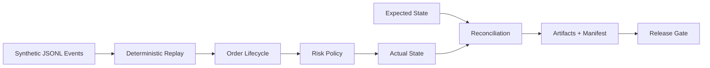

# Architecture

The MVP is intentionally small:



Each module is designed to be testable in isolation and runnable from the CLI.

## Modules

- `replay`: reads synthetic JSONL events and builds deterministic state.
- `orders`: enforces the synthetic order lifecycle.
- `risk`: applies public, synthetic policy checks.
- `reconcile`: compares expected and actual state.
- `artifacts`: writes JSON artifacts and SHA256-backed manifests.
- `gates`: turns replay, reconciliation, and artifact checks into pass/fail.

## Gate Contract

The gate is intentionally strict about artifacts. A process exit code alone is not enough. The expected JSON files must exist, be hashable, be referenced from the manifest, and match the manifest hashes when `gate` or `validate` is run.

## Artifact Directory Contract

`quantengine-public demo` writes a self-contained artifact directory:

```text
artifacts/demo/
  actual_state.json
  replay_errors.json
  reconcile.json
  release_gate.json
  run_manifest.json
```

`quantengine-public validate --artifact-dir artifacts/demo` reuses that directory and recomputes the gate result from the manifest and reports.
