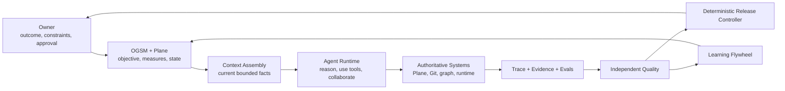
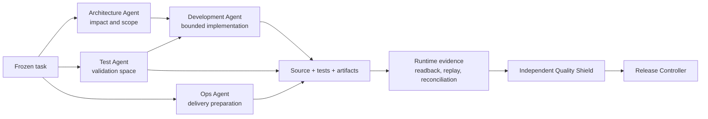

# Evidence-Controlled AI Software Delivery Architecture

Status: target architecture with a runnable public Golden Path, one
identity-bound OpenAI Agents SDK 0.22.0 vertical slice, and an evidence-bound
learning closure

Reference implementation: QuantEngine public-safe synthetic runtime

Public boundary: no private prompts, strategies, accounts, credentials,
production configuration, or deployment authority

## 1. Architecture Identity

This system is an AI software delivery control architecture, not a universal
Agent framework and not a collection of automation scripts.

Its governing principle is:

> Let the model reason. Keep goals, state, dependencies, permissions,
> validation, and evidence outside the model and make them independently
> verifiable.

QuantEngine is the first reference scenario because financial execution makes
identity, provenance, accounting, replay, and authority mistakes easy to expose.
The domain example validates the control architecture; it does not define the
architecture itself.

## 2. Design Principles

1. **One Agent first.** Add a specialist only when ownership, permissions,
   context, tools, or independent evaluation require separation.
2. **Skills preserve method.** High-judgment procedures remain readable and
   adaptable instead of becoming a heavy workflow CLI.
3. **Tools preserve facts.** A small deterministic tool performs one bounded
   read, action, validation, or state write.
4. **Authoritative state outlives chat.** Plane, Git, contracts, and evidence
   stores own facts that cannot depend on conversation memory.
5. **Every handoff is identity-bound.** A downstream producer records the exact
   upstream artifact it consumed.
6. **Unknown is not PASS.** Missing, stale, skipped, malformed, or inconsistent
   evidence stops progression.
7. **The producer cannot certify itself.** Independent quality consumes the
   evidence; a deterministic release controller derives authority.
8. **Failures become executable learning.** A reflection is not complete until
   it creates or changes an eval, regression, Skill, Tool, Contract, Model,
   Data, or Process baseline.

## 3. Layered Architecture

### 3.1 L0: The Control Loop



This is the complete product loop. Individual Agents and tools exist to
preserve it; they are not independent demonstrations.

### 3.2 L1: Responsibility Boundaries

| Layer | Responsibility | Explicit boundary |
| --- | --- | --- |
| Owner | outcome, risk appetite, non-delegable approval | cannot invent technical evidence |
| OGSM / Plane | objective, measures, priority, state, decisions | not runtime truth |
| Context Assembly | retrieve current task-bound facts | not a static knowledge dump |
| Native Agent | reasoning and variable execution | not authoritative memory or implicit permission |
| Skill | procedure, evidence, stop, escalation, handoff rules | not mutable state or a software platform |
| Small Tool / CLI | one deterministic operation | not workflow judgment |
| Trace | observed Agent, model, tool, guardrail, and handoff activity | not evidence admission or authority |
| Evidence | inspectable facts supporting a result | not behavioral quality by itself |
| Eval | declared judgment of Agent behavior or output | not runtime permission |
| Quality Shield | admit the closed evidence set and issue a bounded verdict | cannot create evidence it certifies |
| Release Controller | mechanically derive allowed authority | cannot reinterpret missing evidence |

### 3.3 L2: Specialist Delivery Roles



- **Architecture Agent** reads the accepted task and revision-bound graph,
  identifies affected contracts and risk surfaces, and emits bounded scope.
- **Test Agent** defines expected success, failing regressions, negative cases,
  process checks, and required evidence before implementation is accepted.
- **Development Agent** changes approved scope and cannot rewrite the accepted
  objective or test meaning.
- **Ops Agent** prepares CI/CD, artifact identity, readback, rollback, and
  runtime evidence requirements from the beginning.
- **Quality Shield** independently evaluates the complete evidence set,
  including runtime evidence. It never grants Paper, Real, or deployment
  authority directly.
- **Release Controller** is deterministic and can grant only the intersection
  of authority admitted by runtime evidence, independent quality, policy, and
  explicit Owner approval.

## 4. Agent Collaboration Semantics

The system permits only three collaboration modes.

### Agent as tool

The coordinating Agent retains task ownership and requests one bounded output
from a specialist. The caller is responsible for integrating the result.

Use this when the specialist provides analysis or a proposal but should not own
the next user-facing or state-changing action.

### Handoff

Task ownership transfers to a specialist through a versioned request and a
handoff receipt containing task, source, scope, state, and evidence identities.
The receiving Agent must reject stale or incomplete handoffs.

Use this when the next specialist owns a distinct phase and its state changes.

### Independent review

The reviewer does not take over implementation. It consumes a closed evidence
set and returns a bounded verdict such as `PASS`, `BLOCKED`, `EVIDENCE_GAP`, or
`REVISION_REQUIRED`.

Use this when separation of producer and certifier is required.

### Runtime compatibility

The contracts remain runtime-agnostic, but the Owner-approved MVP implementation
uses OpenAI Agents SDK Python as its single Agent runtime dependency. It reuses
SDK Agent execution, Agent-as-tool, handoffs, SQLite sessions, serializable run
state, approvals, and tracing instead of rebuilding those mechanisms.

Repository-owned code remains deterministic and narrow: task/source/context
identity, role transitions, cross-run handoff receipts, evidence admission,
independent Quality, and Release authority. A second overlapping orchestration
framework is outside MVP scope. These SDK capabilities are described in the
[OpenAI Agents SDK repository](https://github.com/openai/openai-agents-python).

Model or provider selection is part of the run identity. Changing it may require
re-evaluation, but it does not change which system owns task state, evidence, or
authority.

## 5. Task State Machine

```text
PROPOSED
  -> TASK_ACCEPTED
  -> ARCHITECTED
  -> VALIDATION_READY
  -> IMPLEMENTING
  -> VERIFYING
  -> RUNTIME_EVIDENCE_READY
  -> QUALITY_REVIEW
  -> RELEASE_REVIEW
  -> RELEASE_ACCEPTED | REVISION_REQUIRED | BLOCKED | STOPPED
```

State transitions require:

- an allowed current state;
- the exact task and source identity;
- the producer authorized for the transition;
- all required upstream evidence;
- an idempotency key for repeatable writes;
- an explicit next owner.

A source revision, accepted requirement, contract, permission, or required
evidence change invalidates downstream results that consumed the previous
identity. A retry may reuse immutable evidence, but it cannot rewrite history.

Owner approval is required for objective changes, scope expansion beyond the
accepted boundary, release-policy exceptions, deployment, Real authority, and
any destructive or externally consequential action not already authorized.

## 6. Dynamic Context Assembly

The system does not treat memory as a large static RAG archive. Each run builds
a bounded context from current authoritative facts:

```text
accepted task and decisions
+ current repository, branch, commit, and source tree
+ revision-bound component and dependency graph
+ role-specific Skill and allowed tools
+ current blockers and admitted evidence
+ directly related regressions and AAR index
= bounded Agent context
```

The context assembler records what it selected and why. A stale graph, missing
decision, or source mismatch is a blocker rather than permission to fall back to
chat memory.

Plane preserves intent and decisions. Git preserves implementation history. The
code graph exposes current architecture. Evidence records what actually ran. A
small identity index connects these facts without requiring the model to trust
a large prose archive.

## 7. Identity, Trace, Evidence, Eval, And Authority

These are separate concepts.

| Concept | Answers | Cannot prove alone |
| --- | --- | --- |
| Identity / fingerprint | exactly which input or output? | quality or permission |
| Trace | what calls, tools, handoffs, and guardrails occurred? | correctness |
| Evidence | what facts support the result? | Agent behavioral quality |
| Eval | did behavior and output meet a declared standard? | runtime authority |
| Authority | what action is allowed next? | that upstream evidence is true |

### Identity graph

Each producer owns its output identity and records exact upstream identities:

```text
objective_id
  -> plane_task_id
  -> architecture_packet_id
  -> validation_plan_id
  -> source_commit + source_tree
  -> patch_id + test_run_id
  -> package_id
  -> runtime_evidence_id
  -> qcs_receipt_id
  -> quality_verdict_id
  -> release_decision_id
```

Names, nearby timestamps, similar results, or plausible prose cannot create an
edge. A digest must resolve to the declared artifact type and owning producer.

### Trace correlation

Operational traces should correlate at least:

- `task_id` and accepted decision revision;
- `run_id` and `trace_id`;
- source revision and context snapshot digest;
- Agent role, Skill version, model/provider, and tool identities;
- handoff or approval identity;
- result and evidence artifact digests;
- latency, token/cost class, retries, and stop reason.

Trace data supports debugging and evals. It never grants authority.

### Agent evals

Every specialist requires behavioral and result evals appropriate to its role:

- task success and acceptance coverage;
- correct tool and data-source selection;
- handoff ownership and completeness;
- scope adherence and unauthorized-action rate;
- stale-context and evidence-gap detection;
- false-PASS and missed-blocker rate;
- regression recurrence, rework, latency, and cost.

Deterministic tests remain the oracle where one exists. Model-graded evaluation
may supplement a rubric, but it cannot replace repository, runtime, accounting,
or authority facts.

## 8. Validation And Release Order

The target causal order is:

```text
objective and acceptance
  -> architecture and scope
  -> validation space
  -> implementation and deterministic tests
  -> Ops plan and artifact identity
  -> runtime execution and readback evidence
  -> QCS risk evidence
  -> independent Quality Shield verdict
  -> deterministic Release Controller
  -> bounded authority
```

The runtime producer emits evidence with zero delivery, Paper, or Real authority.
Quality Shield confirms that the complete evidence set is admissible but also
emits zero runtime authority. Only the Release Controller may derive non-zero
authority, and only for a passing release verdict.

Unknown, incomplete, stale, skipped, mismatched, or unsupported facts remain
`BLOCKED`, `EVIDENCE_GAP`, `FAIL_CLOSED`, or `REVISION_REQUIRED`.

## 9. Learning Flywheel

An AAR is an index into the next engineering action, not the end of learning.

```text
problem or drift observed
  -> failure evidence retained
  -> reflection and root cause
  -> Owner decision
  -> new eval or regression case
  -> classify repair layer:
       Skill | Tool | Contract | Model | Data | Process
  -> implement bounded change
  -> replay historical failures
  -> independent review
  -> KEEP | CHANGE | STOP | COLLECT_MORE
  -> promote accepted baseline
```

This loop keeps memory dynamic: failed paths become executable checks, accepted
decisions become task state, implementation becomes Git history, and verified
results become content-addressed evidence.

TASKSYS-1264 executes this loop for the Release authority-topology defect. The
retained evidence chain binds the original Release receipt, seven named attack
replays, the exact repair layer and red-test receipt, independent Quality
promotion review, and the final zero-authority AAR. The verifier rejects
missing, forged, stale, cross-task, or self-reviewed learning evidence. Its
local historical-defect replay does not grant or imply QuantEngine Replay,
deployment, Paper, or Real authority.

## 10. QuantEngine Reference Scenario

The domain reference extends the delivery identity graph through a financial
execution path:

```text
Research evidence
  -> candidate semantics
  -> sealed package
  -> synthetic market-data window
  -> Paper runtime + independent Replay
  -> accounting and reconciliation
  -> runtime evidence receipt
  -> independent Quality Shield
  -> bounded Paper authority
```

The target provider ownership is:

| Provider | Owns | Public-safe proof |
| --- | --- | --- |
| QuantLab / AlphaBench | experiment and complete trial ledger | synthetic passed, failed, and pruned trials |
| QuantStrategies | candidate semantics and lineage | non-proprietary synthetic contracts |
| tick-data-center | versioned market-data facts | generated events and coverage receipts |
| market-causality | independent market episodes | synthetic market-first episodes |
| QuantEngine | Paper, Replay, accounting, reconciliation | current runnable reference slice |
| Komodo | fixed Research and Paper runbook | synthetic runbook with no production authority |

QuantEngine produces runtime evidence. It does not independently grant the
final authority that relies on its own result.

## 11. Public Module Plan

| Current system capability | Public equivalent | Status | Required proof |
| --- | --- | --- | --- |
| LDA Control Plane | thin `public-control-plane` | MVP slice implemented | SQLite task/source/context state, evidence-gated transitions, idempotency, restart and cross-run receipts |
| Agent runtime | OpenAI Agents SDK Python adapter | MVP slice implemented; pinned to 0.22.0 | bounded Agent graph, durable identity envelope, resume, approvals and local trace proof |
| Architecture Agent | `public-architecture-agent` | Skill plus SDK Agent-as-tool slice implemented | revision-bound graph and impact packet |
| Test / Quality Lab Agent | `public-test-agent` | two identity-bound Test runs implemented in the slice | authored red oracle, negative cases and independent verification |
| Development Agent | `public-development-agent` | bounded runtime slice implemented | approved-path patch manifest and scope receipt |
| Ops Agent | `public-ops-agent` | bounded runtime slice implemented | CI/package/readback evidence with zero deployment authority |
| Quality Shield | `public-quality-shield` | independent SDK run plus deterministic gate implemented | exact runtime-bound verdict and attack tests |
| Release Controller | `public-release-controller` | deterministic evidence controller implemented | exact type/digest/producer topology and zero-authority slice verdict |
| QCS | `public-qcs` | deterministic Golden Path slice | advisory risk manifest and evidence-gap receipt |
| S3 / WORM evidence | `public-evidence-store` | planned | digest, retention, immutability receipt |
| Understand Anything | `public-code-graph` | planned | source-bound graph and freshness receipt |
| Sonar / CI / k6 | `public-quality-adapters` | CI partial; adapters planned | findings, build, and capacity receipts |
| QuantLab / AlphaBench | `public-quant-lab` | planned | complete synthetic trial ledger |
| QuantStrategies | `public-quant-strategies` | planned | candidate lineage contract |
| tick-data-center | `public-tick-data-center` | planned | versioned synthetic market facts |
| market-causality | `public-market-causality` | planned | independent synthetic episodes |
| QuantEngine | `quantengine-public` | implemented | package, Paper, Replay, reconciliation, runtime evidence |
| Komodo | `public-komodo-runbook` | planned | fixed synthetic Research/Paper path |

Tools such as Plane, GitHub, Sonar, k6, S3, and Understand Anything are not
listed as decoration. Each controls a named drift surface: goal, source,
quality, capacity, evidence retention, or architectural freshness.

## 12. Packaging And Minimalism

The public edition remains one repository while the first complete Golden Path
is still being proven. Logical ownership is separated through Skills,
contracts, producer identities, tests, and import boundaries.

```text
skills/                  high-judgment operating procedures
contracts/               versioned cross-module contracts
src/quantengine_public/  deterministic public reference mechanics
examples/golden_path/    one end-to-end synthetic change
examples/showcase/       committed QuantEngine runtime evidence
tests/                   positive, negative, boundary, and contract tests
```

Separate services, queues, databases, or repositories are introduced only when
a proven runtime, scaling, ownership, or trust boundary requires them. The
architecture must not recreate a heavy workflow platform under a new name.

## 13. Public Boundary And Acceptance

Every implemented public module must provide:

1. a small runnable entry point;
2. versioned input and output contracts;
3. positive and negative paths;
4. inspectable example evidence;
5. tests proving role and authority boundaries;
6. explicit implementation status;
7. a statement of what it cannot authorize.

The public system may use synthetic tasks, repositories, strategies, market
events, account states, runtimes, failures, and evidence. It must not include
private prompts, real strategies, real account data, credentials, private
hosts, production configuration, signing secrets, or deployment logic.

The current reader path is:

```text
README control thesis
  -> 14-artifact software-delivery Golden Path
  -> request-bound negative evidence
  -> QuantEngine runtime reference evidence
  -> contracts and tests
  -> this target architecture and module plan
```
