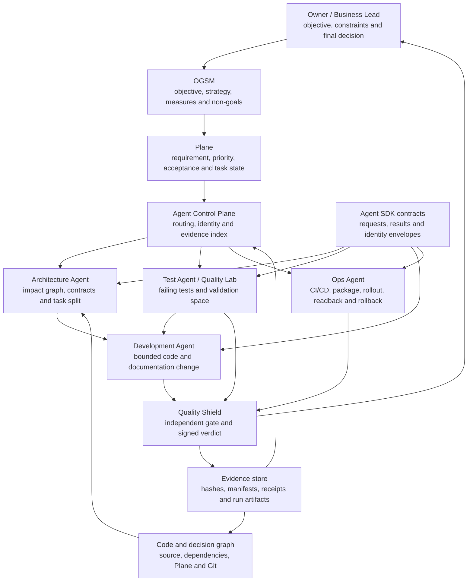
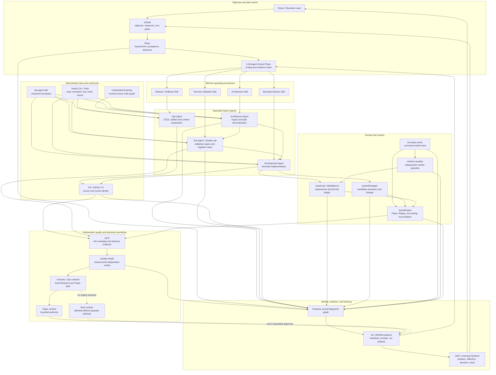

# Multi-Agent Public Architecture

Status: public architecture baseline and implementation map

Scope: public-safe equivalents of the complete private architecture

Current repository state: runnable software-delivery Golden Path plus validation
and release-evidence slice; full provider module set remains the next public
architecture target

## 1. Purpose

The target system coordinates specialist Native Agents as a software delivery
organization. Architecture, Test, Development, Ops, and independent Quality
retain separate responsibilities while every handoff remains traceable.

The intended operating result is:

```text
requirement
  -> architecture impact and task decomposition
  -> validation space
  -> bounded implementation
  -> CI/CD and runtime preparation
  -> independent verification
  -> bounded release decision
  -> evidence-backed reflection
  -> next requirement
```

## 2. Complete Collaboration Model



The arrows do not grant authority by themselves. Every transition requires a
contract, a matching identity, the required evidence, and an allowed next
state.

### 2.1 Expanded End-To-End Architecture

The collaboration diagram above emphasizes professional responsibility. The
expanded view below includes the Skills, deterministic tools, provider modules,
fingerprints, gates, evidence, and learning flywheel that make the collaboration
recoverable and resistant to drift.



This is the target public architecture. The current implementation status is
listed in the Public Module Plan; the diagram does not imply that every node is
already runnable in this repository.

## 3. Role Responsibilities

### Owner and OGSM

The Owner supplies the business outcome and makes decisions that cannot be
delegated safely. OGSM freezes the objective, measures, strategies, non-goals,
and assumptions so implementation activity cannot silently redefine success.

### Plane

Plane owns the human-visible requirement, task state, priority, acceptance
criteria, decisions, and approval trail. It is not replaced by Agent chat.

### Agent Control Plane

The control plane reads authoritative task and source state, routes bounded
work, preserves identity across handoffs, indexes evidence, and stops on stale
or inconsistent facts. It does not implement domain logic or certify its own
outputs.

### Architecture Agent

The Architecture Agent combines the frozen requirement with the current code
and dependency graph. It identifies affected repositories, components,
contracts, risks, and forbidden scope, then produces bounded work packets for
the other roles.

### Test Agent / Quality Lab

Testing begins before implementation. The Test Agent converts acceptance
criteria and risk hypotheses into failing tests, negative cases, process
validation, replay checks, and explicit expected results. This establishes the
validation space: the executable definition of how success and failure will be
distinguished.

### Development Agent

The Development Agent changes only the approved files and contracts. It can
propose implementation choices, but it cannot broaden scope, rewrite the
acceptance criteria, suppress a failing test, or approve its own work.

### Ops Agent

The Ops Agent participates from the beginning. It prepares CI/CD, build and
artifact identity, environment checks, deployment and rollback plans, runtime
readback, and operational evidence. A merged change is not treated as a
deployed or healthy runtime.

### Quality Shield

Quality Shield consumes independently produced evidence, checks closed-world
requirements, and emits a bounded verdict. Missing provenance, mismatched
identity, skipped tests, stale evidence, or unauthorized state produces a
block, not an inferred PASS.

## 4. Fingerprints And The Identity Graph

One universal ID is not enough. Each producer records the identity it owns and
the exact upstream identity it consumed. A representative chain is:

```text
objective_id
  -> plane_task_id
  -> architecture_packet_id
  -> validation_plan_id
  -> source_commit and source_tree
  -> patch_id and test_run_id
  -> artifact_digest
  -> candidate_id and package_id
  -> runtime_run_id and replay_run_id
  -> reconciliation_id
  -> quality_receipt_id
  -> release_decision_id
```

The trading research example extends that chain across Research, candidate,
package, experiment, replay, market episode, decision, order, fill, closed
trade, and later Paper evidence.

Names, nearby timestamps, similar PnL, matching prose, or a later Agent's guess
cannot create an identity edge. The producing module must persist it.

## 5. Gates And Closed-World Progression

The system does not use one final PASS button. It uses explicit gates at the
boundaries where responsibility changes:

```text
objective gate
  -> architecture and scope gate
  -> validation-space gate
  -> implementation and source-identity gate
  -> deterministic test and CI gate
  -> artifact and provenance gate
  -> runtime / replay / reconciliation gate
  -> independent quality gate
  -> Owner decision
```

Every state has a finite allowed vocabulary. Unknown, incomplete, stale, or
inconsistent evidence remains `BLOCKED`, `INCONCLUSIVE`, or `FAIL_CLOSED`; it is
never translated into success for compatibility or convenience.

## 6. Evidence Model

Evidence must remain inspectable after the Agent session ends. Depending on the
stage, that includes:

- the frozen OGSM and Plane task snapshot;
- architecture impact packet and allowed scope;
- validation plan, failing tests, negative cases, and expected results;
- repository, branch, commit, source-tree, patch, and dependency fingerprints;
- CI results, static analysis, declared test receipts, and skipped-test status;
- package manifests, content digests, runtime readbacks, and rollback evidence;
- Paper and independent Replay artifacts;
- reconciliation, accounting, stress, and recovery results;
- Quality Shield verdicts and Owner decisions;
- failed attempts and rejected candidates, not only the winner.

Code, tests, authoritative readback, and immutable artifacts outrank summaries
or conversational memory.

## 7. The Learning Flywheel

The system does not treat memory as a large static RAG archive. Durable learning
is reconstructed from a small identity graph over changing authoritative facts:

```text
problem observed
  -> failed attempt or risk exposed
  -> reflection
  -> Owner decision
  -> task and code change
  -> tests and runtime evidence
  -> result
  -> AAR: KEEP / CHANGE / STOP / COLLECT_MORE
  -> next objective and experiment
```

Plane preserves intent and decisions. Git preserves implementation history.
The code graph exposes current architecture and impact. Evidence artifacts show
what actually ran. Together they keep learning dynamic and traceable without
requiring the model to search or believe a large prose archive.

## 8. Skill-Led Native-Agent Architecture

The target responsibility boundary is:

| Work type | Owner | Examples |
| --- | --- | --- |
| High-judgment workflow | Skill | architecture review, test strategy, incident handling, release review |
| Variable execution | Native Agent | repository analysis, code change, browser/runtime interaction, evidence interpretation |
| Deterministic operation | Small CLI / Tool | state read, identity normalization, digest verification, declared test run, receipt write |
| Human-visible state | Plane / Git | objective, task, decision, code, PR and change history |
| Independent verdict | Quality Shield | evidence admission, gate result and bounded authority |

A Skill is not a renamed super-CLI. It is a concise operating contract that
keeps the model free to reason while preserving role, evidence, stop, and
approval boundaries. Small CLIs cannot choose the workflow, and Native Agents
cannot invent facts that belong to authoritative systems.

## 9. Public Module Plan

The next public edition is intended to contain public-safe equivalents of every
important module. These are capability demonstrations, not mirrors of private
strategy, account, credential, or production code.

| Current system module | Planned public equivalent | Responsibility | Public-safe evidence |
| --- | --- | --- | --- |
| LDA Control Plane | `public-control-plane` | task intake, bounded routing, identity index | synthetic Plane task and deterministic handoff receipts |
| `lda-agent-sdk` | `public-agent-sdk` | request, result and fingerprint contracts | versioned schemas and negative contract tests |
| `architecture-agent` | `public-architecture-agent` | graph-based impact and task decomposition | synthetic repository graph and architect packet |
| Development Worker | `public-development-agent` | bounded implementation proposal | allowed-path patch and scope receipt |
| `qe-quality-lab` / Test Agent | `public-test-agent` | validation space, attack tests and process verification | failing tests, negative cases, load probes and process plan |
| `ops-agent` | `public-ops-agent` | CI/CD, artifact, rollout and rollback preparation | synthetic pipeline, package and readback receipts |
| Quality Shield | `public-quality-shield` | independent evidence gate | closed-world verdict and provenance tests |
| QCS / Quality Campaign System | `public-qcs` | select risk surfaces and orchestrate owner-owned quality evidence | deterministic campaign manifest, advisory receipt and evidence-gap cases |
| S3 / WORM evidence path | `public-evidence-store` | immutable evidence registration | local object-store fixture, digests and retention contract |
| Understand Anything | `public-code-graph` | current architecture and dependency impact | generated graph bound to source revision and freshness receipt |
| Sonar, CI and k6 adapters | `public-quality-adapters` | static quality, build and capacity readback | synthetic Sonar findings, CI checks and k6 load-test receipts |
| QuantLab / AlphaBench | `public-quant-lab` | experiment and complete trial ledger | synthetic trials including failed and pruned runs |
| QuantStrategies | `public-quant-strategies` | candidate semantics and lineage | non-proprietary synthetic candidate contracts |
| `tick-data-center` | `public-tick-data-center` | versioned market-data facts | generated synthetic events and coverage receipts |
| `market-causality` | `public-market-causality` | independent market episodes | synthetic market-first episodes without strategy labels |
| QuantEngine | `quantengine-public` | Paper, Replay, accounting and reconciliation | the runnable slice already present in this repository |
| Komodo | `public-komodo-runbook` | fixed Research / Paper operating path | local synthetic runbook with no production authority |

These third-party and platform components are not included as decoration:

- Plane controls requirement, priority, acceptance, and approval drift;
- Git and GitHub control source, review, and change-history drift;
- Understand Anything controls stale architectural understanding by binding the
  graph to the current source revision;
- Sonar, repository tests, Quality Lab, and QCS expose different quality and
  risk surfaces without becoming new business-truth owners;
- k6 tests whether a functionally correct change still respects capacity and
  latency expectations;
- S3 / WORM storage prevents receipts and run evidence from disappearing or
  being silently replaced;
- Komodo fixes Research and Paper runbooks so runtime-template drift cannot turn
  a previously reviewed candidate into a different execution.

### Current state

The current repository implements:

- the `quantengine-public` validation slice: admission, content-addressed
  package, synthetic Paper, independent Replay, reconciliation, negative cases,
  recovery evidence, and bounded release verdict;
- one public delivery Artifact envelope with closed statuses, producer-owned
  upstream fingerprints, and deterministic digest verification;
- four public Skills for Architecture, Test-first Validation, Bounded
  Development, and Ops Delivery Review;
- one 13-artifact Golden Path and nine committed fail-closed receipts;
- CI and tests that re-verify committed evidence.

The other rows describe the next public architecture target. Until a module has
code, tests, committed example evidence, and an explicit public boundary, it
must be labeled planned rather than implemented.

### 9.1 Packaging Decision: One Public Repository, Explicit Modules

The first complete public edition will remain one repository so a reviewer can
clone it, run one synthetic Golden Path, and inspect one evidence set. Logical
ownership will still be explicit:

```text
skills/                  high-judgment operating procedures
contracts/               versioned cross-module schemas
src/public_control/      intake, routing and evidence index
src/public_agents/       architecture, test, development and ops adapters
src/public_quality/      QCS and Quality Shield public equivalents
src/public_providers/    research, strategy, data, causality and engine modules
examples/golden_path/    one end-to-end synthetic requirement
evidence/showcase/       committed inspectable artifacts
tests/                   positive, negative, boundary and mutation tests
```

Module boundaries will be enforced by contracts, dependency rules, tests, and
producer-owned identities. Separate services or repositories will be introduced
only when a proven public use case requires an independent runtime or trust
boundary. The public architecture will not create infrastructure merely to look
distributed.

## 10. Public Boundary

The public system may include synthetic requirements, repositories, strategies,
market events, account state, CI, runtime, failures, and evidence. It must not
include private strategies, real account data, exchange credentials, private
hosts, production configuration, signing secrets, or private deployment logic.

Every public module must provide:

1. a small runnable entry point;
2. versioned input and output contracts;
3. at least one positive path and one negative path;
4. inspectable example evidence;
5. tests that prove its role boundary;
6. a statement of what it cannot authorize.

## 11. Reader Path

The completed public architecture should let a reviewer follow one synthetic
requirement across the entire system:

```text
requirement and OGSM
  -> architecture packet
  -> validation space
  -> bounded implementation
  -> CI/CD package
  -> Quality Shield verdict
  -> QuantLab / strategy / data provider handoffs
  -> QuantEngine Paper and Replay
  -> reconciliation and release evidence
  -> AAR and next-cycle decision
```

That path is the product. Individual tools and Agents exist to preserve it, not
to become isolated demonstrations.
