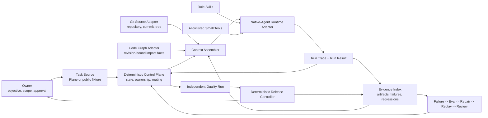

# Native-Agent Multi-Agent Platform MVP Technical Design

Date: 2026-08-26

Status: Owner-approved reuse-first implementation baseline; development paused
by Owner and resumable only on later explicit direction

Audience: platform, Agent, quality, and delivery engineers

Scope: one real, resumable, evidence-controlled software-delivery path

## 1. Objective

Build the smallest real multi-Agent software-delivery platform that can take one
accepted task through Architecture, Test, Development, Ops, independent Quality,
deterministic Release control, and learning evidence without relying on chat
memory as process state.

The MVP must prove that specialist Native Agents can retain their reasoning and
tool-use ability while a deterministic control plane owns:

- objective and task identity;
- source and context identity;
- role, ownership, and allowed transitions;
- tool and authority boundaries;
- evidence admission and invalidation;
- retry, interruption, and resume;
- independent Quality and final Release decisions.

The goal is not to build a universal Agent framework. The goal is to prove one
complete platform control loop that can later accept additional roles and
domain providers without changing its trust model.

## 2. Runtime Is Not The Harness

### 2.1 Harness

The current Golden Path is a deterministic demonstration harness.

```text
fixed request
  -> call deterministic Python functions
  -> generate the expected 14 artifacts
  -> inject named failure cases
  -> verify contracts, digests, order, and authority
```

The harness is valuable because it is cheap, repeatable, and suitable for CI.
It acts as a contract oracle and regression suite. It does not execute a real
model, let an Agent choose tools, transfer live ownership, or resume a stopped
Agent task.

### 2.2 Native-Agent runtime

The runtime executes a real bounded Agent turn.

```text
RunRequest
  -> load current task and source identity
  -> assemble bounded context
  -> load the role Skill
  -> expose only allowed tools
  -> invoke the selected Native-Agent provider
  -> observe tool calls, output, stop reason, and failure
  -> validate and seal RunResult
  -> persist trace and evidence
  -> return control to the control plane
```

The runtime does not decide the business workflow or grant release authority.
It executes one role under one accepted request.

### 2.3 Control plane

The control plane decides whether a run may start and what happens after it
ends.

```text
current task state + admitted evidence + policy
  -> allow, block, retry, resume, hand off, request review, or stop
```

It is deterministic code, not another coordinating Agent.

### 2.4 Relationship

```text
Harness      = test driver and oracle
Runtime      = executes one real Agent turn
ControlPlane = owns state, routing, and transition policy
Skill        = preserves the role method and stop conditions
Small Tool   = performs one deterministic read, action, or state write
```

The new runtime must pass the existing harness contracts. It must not replace or
weaken the harness.

### 2.5 Agent runtime and domain runtime

This repository also calls QuantEngine a runtime. These are two different
execution layers:

```text
Native-Agent runtime
  -> executes Architecture, Test, Development, Ops, or Quality reasoning

Domain runtime
  -> executes the software being delivered, such as QuantEngine Paper/Replay
```

The Agent runtime may prepare, inspect, test, or review a domain-runtime change.
It cannot invent domain-runtime evidence. Ops starts the declared domain run,
and the domain runtime emits its own readback and evidence for independent
Quality and Release control.

## 3. Current Baseline And Entry Conditions

The repository already provides:

- four public role Skills;
- a 14-artifact deterministic Golden Path;
- content-addressed evidence envelopes;
- producer identities and request-bound negative receipts;
- a QuantEngine synthetic Paper/Replay runtime;
- CI evidence reproduction and public safety scanning.

Before the platform may grant any non-zero authority, implementation must close
the existing Release-topology bypass recorded in the interviewer review backlog.
A passing Release artifact must be impossible without exact admitted runtime
evidence and an independent Quality verdict.

The package, CLI, tag, and Release version identity must also be made consistent
before the first runtime release.

### 3.1 Approved reuse decision

The MVP will not implement a generic Agent loop, conversation store, ordinary
handoff mechanism, approval loop, or tracing subsystem from scratch. The
Owner-approved runtime baseline is the MIT-licensed OpenAI Agents SDK for
Python.

Reuse from the SDK:

- `Agent` and `Runner` execution;
- `Agent.as_tool()` and handoffs;
- `SQLiteSession` for Agent conversation history;
- serializable `RunState` for interruption, approval, and resume;
- tool approvals, guardrails, and structured results;
- tracing with a repository-owned public-safe exporter;
- Shell, ApplyPatch, MCP, and Sandbox Agent capabilities only after each
  selected capability passes the repository's fail-closed wrapper tests.

Keep repository-owned deterministic code only for:

- task, source, context, Skill, tool-policy, and evidence identity;
- allowed role transitions and idempotent cross-run state;
- cross-run handoff receipts and source invalidation;
- evidence admission, producer separation, and failure retention;
- independent Quality boundaries and Release authority topology.

Do not add LangGraph, AutoGen, CrewAI, Microsoft Agent Framework, or another
overlapping orchestration framework to the MVP. in-toto compatibility and
GitHub Agentic Workflows are optional Milestone 6 integrations, not control
plane dependencies.

The SDK does not become an authority source. SDK sessions, traces, handoffs,
guardrails, approvals, or model outputs cannot grant Quality, Release, deploy,
Paper, or Real authority.

### 3.2 Current execution status

As of the 2026-08-26 source-alignment pass, development is intentionally
paused by Owner and does not resume automatically when alignment finishes. No
Milestone 0-6 Agent-platform implementation has started. The current runnable
truth remains the deterministic Golden Path and synthetic QuantEngine reference
runtime described above.

## 4. MVP Boundaries

### 4.1 Included

- one repository;
- one accepted task at a time per task identity;
- Architecture, Test, Development, Ops, and independent Quality roles;
- one OpenAI Agents SDK Python runtime adapter;
- the three collaboration modes: Agent-as-tool, handoff, independent review;
- current Git source identity;
- optional Plane task input through an adapter;
- revision-bound code-graph input through an adapter;
- local SQLite task state;
- local content-addressed evidence files;
- synchronous execution with durable checkpoints between Agent turns;
- deterministic Release control;
- one real failure-to-regression learning example.

### 4.2 Explicit non-goals

- a general workflow language;
- a large end-to-end CLI;
- a web dashboard;
- a message broker or distributed scheduler;
- multi-tenant operation;
- parallel Agent swarms;
- automatic merge or production deployment;
- automatic Paper or Real trading authority;
- rebuilding Plane, Git, S3, CI, or the code-graph system;
- supporting multiple Agent providers before one adapter works;
- implementing every planned public provider module.

## 5. Governing Principles

1. **One Agent first, separation by responsibility.** A role becomes a separate
   Agent only because instructions, context, tools, permissions, ownership, or
   independent evaluation require it.
2. **Control state is not chat memory.** The task can be resumed from the state
   store and evidence after every conversation is lost.
3. **Every run is identity-bound.** Task, source, context, Skill, tool policy,
   upstream evidence, and output identities are recorded.
4. **Unknown is not PASS.** Missing, stale, malformed, skipped, mismatched, or
   unobservable facts stop progression.
5. **The producer cannot certify itself.** Development cannot approve tests,
   runtime cannot approve Quality, and Quality cannot grant authority.
6. **Agents do judgment; tools do facts.** An Agent may reason about what to do,
   but deterministic tools read source identity, calculate hashes, execute
   declared tests, and write state.
7. **Append history; do not rewrite it.** Retries create new attempts and
   transitions. Failed evidence remains inspectable.
8. **No platform inside a Skill or CLI.** Skills preserve method; small tools
   preserve repeatable mechanics; the control plane owns orchestration.

## 6. Target MVP Architecture



## 7. Component Responsibilities

### 7.1 Task source adapter

Reads an accepted task without making workflow decisions.

Minimum output:

- task id and objective revision;
- objective, measures, acceptance criteria, and non-goals;
- approved repository and scope;
- Owner decisions and required approvals;
- external task revision or fixture digest.

The public implementation may use a committed task fixture. A private deployment
may use Plane. Both must produce the same `TaskSnapshot` contract.

### 7.2 Git source adapter

Deterministically records:

- repository identity;
- branch;
- full commit SHA;
- source-tree digest;
- dirty or clean state;
- changed paths relative to the accepted base when required.

An Agent cannot supply these facts from prose.

### 7.3 Code-graph adapter

Returns graph identity and selected architecture facts bound to the exact source
revision.

It must fail with `STALE_CONTEXT` when the graph revision does not match the
task source. Chat memory or a previous graph is not an allowed fallback.

### 7.4 Context assembler

Builds the smallest role-specific context from authoritative inputs:

```text
TaskSnapshot
+ SourceSnapshot
+ matching GraphSnapshot
+ role Skill identity
+ allowed tool policy
+ admitted upstream evidence
+ current blockers
+ directly related regression and AAR references
= ContextSnapshot
```

The assembler records every selected item, its identity, and the reason it was
included. It never includes credentials, private prompts, unrelated history, or
an unbounded knowledge dump.

### 7.5 OpenAI Agents SDK runtime adapter

Wraps OpenAI Agents SDK Python. The platform must not implement its own generic
model loop or duplicate SDK session, handoff, approval, or tracing mechanics.

Responsibilities:

- accept one closed `RunRequest`;
- start one bounded role run;
- load the declared Skill;
- expose only declared tools;
- capture model/provider identity where available;
- observe tool calls, output, stop reason, duration, retries, and cost metadata;
- return a structured `RunResult`;
- stop on timeout, cancellation, permission denial, or invalid output;
- never write authoritative task state directly.

The first adapter may execute synchronously. Async scheduling is unnecessary for
the MVP because durable state exists between runs.

### 7.6 Tool policy and registry

Maps each role to a small allowlist.

| Role | Initial tool boundary |
| --- | --- |
| Architecture | read task, Git, graph, contracts, and source; no edits |
| Test | read accepted scope; create or propose declared tests only |
| Development | read source; edit only approved paths; run declared local tests |
| Ops | build, run CI checks, hash artifacts, collect readback; no deployment |
| Quality | read closed evidence and run declared verification; no edits |
| Release Controller | deterministic evidence read only; no model and no tools with side effects |

Every tool call records tool identity, normalized arguments or argument digest,
result status, result digest, duration, and error class. Secrets and raw private
content are excluded from public traces.

### 7.7 State store

Reuse the SDK `SQLiteSession` for Agent conversation history and serialized
`RunState` for paused-run continuation. Add only a thin repository-owned SQLite
event index for deterministic platform facts that an Agent session must not
own. This avoids implementing a second conversation store while preserving
transactions, optimistic concurrency, append-only inspection, and exact task
recovery without introducing a service.

Minimum logical records:

| Record | Purpose |
| --- | --- |
| `tasks` | current state, version, owner, source identity, accepted scope |
| `transitions` | append-only state history and decision reason |
| `runs` | one Agent attempt, context, Skill, provider, result, stop reason |
| `handoffs` | from-owner, to-owner, required evidence, acceptance state |
| `artifacts` | type, producer, digest, path, upstream identities, status |
| `tool_calls` | run-bound tool trace and result identity |
| `approvals` | Owner decision identity, scope, status, and expiry if applicable |

Artifact bodies remain content-addressed files. SQLite stores identities and
indexes, not a second mutable copy of every large artifact.

### 7.8 Evidence store

The MVP uses a local append-only run directory plus digest verification.

```text
artifacts/agent-platform/<task_id>/<run_id>/
```

An S3/WORM adapter is a later storage boundary. It must not be required before
the local lifecycle and recovery semantics are proven.

### 7.9 Independent Quality

Quality is a separate read-only Agent run followed by deterministic evidence
admission.

The Quality Agent may identify gaps and recommend `PASS`, `BLOCK`, or
`REVISION_REQUIRED`. Deterministic code verifies that the exact required
evidence exists, has the right producer and topology, matches current task and
source identities, and carries zero authority before sealing the Quality
verdict.

### 7.10 Release Controller

The Release Controller is not an Agent.

It consumes the complete admitted chain and mechanically derives bounded
authority. The public MVP grants no deployment or Real authority. Missing or
failed runtime or Quality evidence returns zero authority.

## 8. Collaboration Semantics

The platform supports three explicit modes.

### 8.1 Agent as tool

The control plane retains task ownership and requests one bounded result.

MVP use: Architecture Agent returns an impact packet to the control plane.

### 8.2 Handoff

Task ownership transfers only after the receiver accepts an identity-bound
handoff.

MVP use: accepted architecture and validation evidence transfer implementation
ownership to Development, then verified source transfers delivery preparation
to Ops.

### 8.3 Independent review

The reviewer never becomes the implementation owner and cannot modify the work
it certifies.

MVP use: Quality reviews the closed source, test, Ops, and runtime evidence set.

Every collaboration record includes:

- task id and task version;
- collaboration mode;
- from-owner and to-role;
- exact source and context identities;
- required upstream artifacts;
- allowed action and forbidden authority;
- acceptance, rejection, or expiry;
- next owner or blocker.

## 9. Task State Machine

The MVP uses one explicit sequential state machine. Parallel role execution may
be added only after the sequential path is reliable.

```text
DRAFT
  -> ACCEPTED
  -> CONTEXT_READY
  -> ARCHITECTURE_READY
  -> VALIDATION_READY
  -> IMPLEMENTATION_READY
  -> TEST_VERIFIED
  -> OPS_READY
  -> RUNTIME_VERIFIED
  -> QUALITY_REVIEWED
  -> RELEASE_DECIDED
  -> LEARNING_RECORDED
  -> CLOSED
```

Cross-cutting non-success states:

```text
BLOCKED
REVISION_REQUIRED
HUMAN_APPROVAL_REQUIRED
CANCELLED
```

Every transition requires:

- expected current state and task version;
- authorized current owner;
- current source identity;
- required admitted upstream evidence;
- idempotency key;
- transition reason;
- explicit next owner.

State writes use compare-and-set on the task version. A retry with the same
idempotency key returns the existing result. A retry with a new key creates a
new attempt without deleting the failed attempt.

## 10. Invalidation Rules

The control plane invalidates downstream results when any consumed identity
changes:

- objective or acceptance revision;
- approved scope;
- repository, branch, commit, or source tree;
- graph revision;
- Skill version;
- tool policy;
- required contract version;
- upstream evidence digest;
- approval identity or expiry.

Invalidation never deletes prior evidence. It marks the affected result
`STALE` for routing purposes, returns the task to the earliest owning state, and
records why.

## 11. Minimum Contracts

### 11.1 TaskSnapshot

```text
schema_version
task_id
task_revision
objective
measures
acceptance_criteria
non_goals
approved_scope
required_approvals
source_reference
snapshot_digest
```

### 11.2 ContextSnapshot

```text
schema_version
task_id + task_revision
role
source_identity
graph_identity
skill_identity
tool_policy_identity
upstream_artifact_refs
selected_context_refs with selection reasons
context_digest
```

### 11.3 RunRequest

```text
schema_version
run_id
task_id + expected_task_version
role
collaboration_mode
context_digest
skill_identity
allowed_tool_policy
required_output_type
upstream_artifact_refs
timeout_policy
idempotency_key
```

### 11.4 RunResult

```text
schema_version
run_id
status
provider and model identity when observable
started_at + completed_at
attempt
output_artifact_ref or blocker_ref
tool_call_refs
stop_reason
usage metadata when observable
requested_next_action
result_digest
```

### 11.5 HandoffReceipt

```text
schema_version
task_id + task_version
from_owner
to_role
source_identity
context_digest
required_artifact_refs
accepted_or_rejected
reason
next_owner
receipt_digest
```

All contracts are closed, versioned, content-addressed, and validated before a
state transition. Contract compatibility must not weaken fail-closed semantics.

## 12. One Real MVP Vertical Slice

The first implementation uses one bounded defect in the public repository.

Recommended case:

> A Release verdict with non-zero authority must fail unless it consumes exact
> passing runtime evidence and an independent Quality verdict.

Execution path:

1. Owner accepts the defect, measures, non-goals, and repository scope.
2. Control plane records `TaskSnapshot` and current Git identity.
3. Context assembler binds current source, contracts, relevant tests, the
   interviewer-review finding, and the Architecture Skill.
4. Architecture Agent runs as an Agent-as-tool and returns affected contracts,
   consumers, risks, allowed files, and required validation questions.
5. Test Agent establishes red tests for empty upstream, missing runtime, missing
   Quality, wrong producer, failed upstream, and authority injection.
6. Development accepts a handoff and changes only approved contract and verifier
   paths.
7. Test independently executes the declared suite and records results.
8. Ops prepares build, clean-install, version, CI, artifact, and rollback
   evidence.
9. The updated public Golden Path runs and produces zero-authority runtime
   evidence.
10. Independent Quality reviews exact source, tests, runtime evidence, and the
    negative attack suite.
11. Release Controller derives bounded public-demo authority only after the
    complete topology passes.
12. AAR binds the original failure, regression ids, repair layer, replay result,
    review receipt, and promotion decision.

This case simultaneously closes the most serious public defect and proves the
first real multi-Agent platform path.

## 13. Failure And Recovery Matrix

| Failure | Required platform result | Resume point |
| --- | --- | --- |
| missing acceptance criterion | `BLOCKED` with Owner as next owner | `DRAFT` |
| source changes before run | `STALE_CONTEXT`; rebuild source and context | `CONTEXT_READY` |
| graph does not match commit | `STALE_CONTEXT`; no chat fallback | `CONTEXT_READY` |
| task version claim conflict | reject duplicate owner claim | current state |
| runtime timeout | retain partial trace, mark attempt failed | same role, new attempt |
| Agent output violates schema | `INVALID_OUTPUT`; no transition | same role |
| unauthorized tool call | `PERMISSION_DENIED`; retain trace | Owner or same role after policy review |
| Development edits outside scope | `SCOPE_ESCAPE`; reject patch | `IMPLEMENTATION_READY` |
| declared red test absent | `EVIDENCE_GAP` | `VALIDATION_READY` |
| tests fail | `REVISION_REQUIRED` | `IMPLEMENTATION_READY` |
| CI or readback missing | `EVIDENCE_GAP` | `OPS_READY` |
| runtime and replay disagree | `FAIL_CLOSED` | `OPS_READY` or owning runtime step |
| Quality finds a gap | `REVISION_REQUIRED` with named owner | earliest owning state |
| required human approval absent | `HUMAN_APPROVAL_REQUIRED` | current state |
| process stops after any committed transition | no state loss | next uncompleted state |
| same idempotency key is retried | return prior result, no duplicate transition | unchanged |

## 14. Trace And Eval Requirements

### 14.1 Minimum trace

Every real Agent run records:

- task, task revision, run, and attempt ids;
- source, graph, context, Skill, and tool-policy identities;
- provider and model identity when observable;
- tool-call identities and results;
- handoff or review identity;
- start, completion, duration, retries, and stop reason;
- output and evidence digests;
- token and cost metadata when observable;
- explicit redaction status.

Trace is debugging and evaluation input. It never grants authority.

### 14.2 Initial deterministic evals

| Role or layer | Initial eval |
| --- | --- |
| Architecture | required impact fields present; source and graph identities match |
| Test | acceptance coverage; at least one negative path; required red tests exist |
| Development | changed paths are within scope; declared tests were not weakened |
| Ops | CI, artifact, clean-install, readback, and rollback evidence complete |
| Quality | known forged-Release attack suite produces zero false PASS |
| Control plane | interruption resumes correctly; duplicate transition count is zero |

Model-graded eval may be added for judgment quality later. It cannot replace
deterministic source, test, runtime, accounting, or authority checks.

## 15. Human Approval Boundary

Owner approval is required for:

- objective or acceptance changes;
- scope expansion;
- change to the allowed repository;
- tool-policy expansion with external side effects;
- merge or publication;
- deployment;
- Paper or Real authority;
- destructive action;
- exception to release policy.

The public MVP may prepare merge or Release evidence but cannot perform those
actions without an explicit approval identity.

## 16. Suggested Source Layout

```text
src/quantengine_public/agent_platform/
  contracts.py          closed task, context, run, handoff contracts
  control_state.py      thin task events, optimistic transitions, SDK run refs
  control_plane.py      routing, invalidation, retry, and resume
  context.py            bounded context assembly
  runtime.py            OpenAI Agents SDK adapter and sealed result conversion
  tool_policy.py        role allowlists and tool-call receipts
  evidence.py           artifact index and topology admission
  evals.py              deterministic role and platform evals
  release.py            deterministic authority derivation
  adapters/
    task_fixture.py
    git_source.py
    code_graph.py
    native_agent.py
tests/agent_platform/
  test_state_machine.py
  test_invalidation.py
  test_runtime_contract.py
  test_tool_policy.py
  test_recovery.py
  test_vertical_slice.py
examples/agent_platform/
  authority_topology_fix/
```

This is a logical layout, not a requirement to create every file before the
first red test. Modules should be introduced only when the vertical slice needs
the boundary.

## 17. Implementation Sequence

### Milestone 0: Correctness precondition

- write the forged-Release red tests;
- close producer, topology, status, and authority validation;
- fix version identity and release smoke testing.

Exit: the existing public contract can safely serve as the platform gate.

### Milestone 1: Contracts and thin durable control state

- freeze `TaskSnapshot`, `ContextSnapshot`, `RunRequest`, `RunResult`, and
  `HandoffReceipt` v1;
- reuse SDK SQLite sessions and serializable `RunState`;
- implement only the append-only task transitions, optimistic versioning,
  idempotency, and SDK run references not owned by an Agent session;
- prove stop and resume without an Agent provider.

Exit: a scripted task survives process termination and resumes exactly once.

### Milestone 2: Context and tool boundaries

- implement task fixture, Git identity, and code-graph adapters;
- implement bounded context selection and stale-context blocking;
- implement role tool policies and denied-call receipts.

Exit: current context is reproducible and an unauthorized tool call is retained
and blocked.

### Milestone 3: OpenAI Agents SDK adapter

- bind the closed runtime contract to OpenAI Agents SDK Python;
- adapt one real Skill-led Agent run without adding another orchestration
  framework;
- capture structured result, trace, failure, timeout, and usage metadata;
- validate output before state transition.

Exit: one Architecture Agent runs as an Agent-as-tool and produces an admitted
architecture packet.

### Milestone 4: Real multi-Agent vertical slice

- add Test, Development, Ops, and independent Quality runs;
- execute handoffs and independent review;
- connect deterministic tests, CI, runtime evidence, and Release control;
- preserve all failure branches.

Exit: the authority-topology defect travels through the full real workflow and
cannot receive PASS before every required stage succeeds.

### Milestone 5: Learning closure

- convert the original failure into retained regression evidence;
- record repair layer and historical replay receipts;
- require independent promotion review;
- emit an evidence-bound AAR.

Exit: the flywheel is executed, not asserted.

### Milestone 6: Public proof and re-review

- add the real vertical slice to a bounded CI or explicitly approved integration
  run;
- publish public-safe trace and evidence;
- update implemented/planned status;
- repeat hiring-manager, technical-interviewer, and senior-architect review.

Exit: the repository can truthfully claim one running multi-Agent platform MVP.

## 18. Test Strategy

1. **Unit tests:** canonical identities, contracts, transition guards, tool
   policy, invalidation, and authority.
2. **Contract tests:** every adapter must satisfy the same closed input and
   output contracts.
3. **Harness tests:** scripted runtime responses reproduce the complete path and
   all named failures without model cost.
4. **Recovery tests:** terminate after every committed state and prove exact
   resume behavior.
5. **Adversarial tests:** stale source, wrong producer, missing upstream,
   authority injection, scope escape, duplicate run, and malformed output.
6. **One real integration test:** run the selected Native-Agent provider on the
   bounded public defect and retain public-safe trace and evidence.

Real model execution should not be required for every unit-test run. The
deterministic harness remains the fast CI oracle.

## 19. MVP Acceptance Criteria

The platform MVP is complete only when:

1. Architecture, Test, Development, Ops, and Quality execute as distinct
   identity-bound Agent runs on one accepted task.
2. At least one Agent-as-tool, one handoff, and one independent-review flow are
   preserved in evidence.
3. Every run uses current task, source, context, Skill, and tool-policy
   identities.
4. The process can stop after any committed state and resume without duplicate
   work or lost evidence.
5. A changed source revision invalidates every downstream result that consumed
   the previous revision.
6. An unauthorized tool call and an out-of-scope patch fail closed.
7. Quality cannot PASS without the exact test, Ops, runtime, and risk evidence.
8. Release cannot grant authority without exact passing runtime evidence and an
   independent Quality verdict.
9. No Agent, including Quality, can directly grant release authority.
10. The original forged-Release case remains a red-then-green regression and is
    linked from the final AAR.
11. The installed package and CLI identify the exact released version.
12. The public evidence contains no private prompts, credentials, repository
    locators, strategies, accounts, or production configuration.
13. The implementation introduces no general workflow language, broker,
    service mesh, dashboard, or super-CLI.

## 20. Developer Handoff Checklist

Before implementation begins, the team must confirm:

- the exact OpenAI Agents SDK version and observable run metadata;
- the exact public defect used by the vertical slice;
- the repository paths allowed for Milestone 0;
- the task and code-graph adapter available in the development environment;
- which actions require Owner approval;
- which trace fields require redaction;
- the state and artifact storage locations;
- the command or test that proves interruption and resume;
- the release version planned after Milestone 0.

If any of these facts is unknown, record a named blocker. Do not silently fill
the gap from chat history.

The documentation and Plane alignment receipt must be complete, and the Owner
must explicitly resume development, before Milestone 0 starts.
