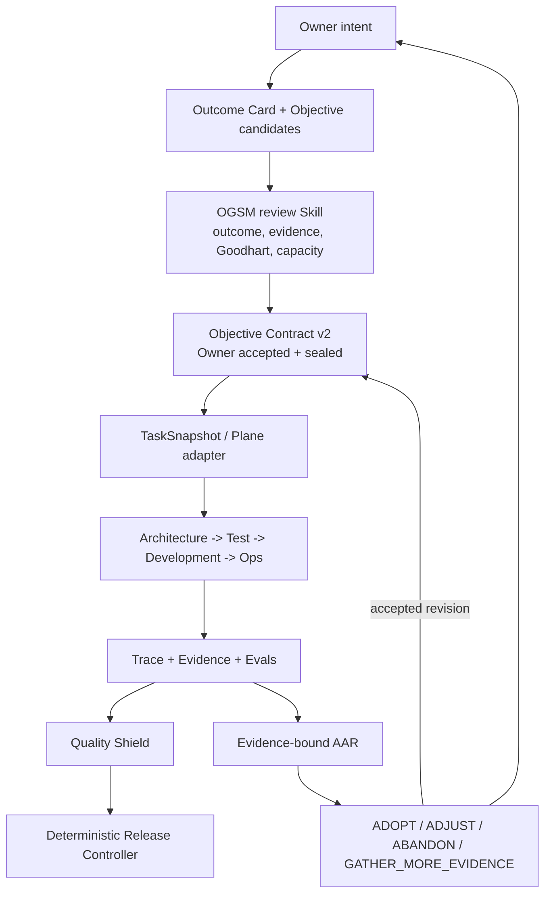

# Public OGSM V2 Goal-Control Slice

Date: 2026-08-27

Status: `M6C_RELEASE_CANDIDATE`

Design and M1 decision: DEC-0037

M2 implementation decision: DEC-0038

M3 Skill decision: DEC-0039

M4 Thin Control decision: DEC-0040

M5 proof decision: DEC-0041

M6A presentation decision: DEC-0042

M6B remote-delivery decision: DEC-0043

M6C release decision: DEC-0044

Dependency: DEC-0031 role-topology slice accepted through PR #12 at main commit
`320d6b21714a168214811faada3970c9ab241b89`.

Acceptance boundary: PR and main CI accepted DEC-0031. The pre-existing
`TASKSYS-1137` inventory-classification failure is unrelated and remains open.
The local Qwen CI lane was configuration-skipped, so it is not evidence of a
local Qwen pass. DEC-0037 may rely on the accepted public topology contract;
it must not upgrade either retained condition into a stronger claim.

Decision-numbering note: commits `f281ddd` and `53c25d4` use `DEC-0032` in
their subjects, and the first M1 test commit also reused that identifier. The
authoritative project registry already assigns DEC-0032 to the DEC-0031 remote
delivery, so this document and all continuing OGSM V2 work use DEC-0037.
Published history is retained as historical, non-authoritative evidence.

## 1. Problem

The public repository already places an OGSM artifact at the start of the
Golden Path, but the current contract proves only that three fields are
present:

- objective;
- acceptance measures;
- non-goals.

That is enough to bind downstream artifacts to a declared request. It is not
enough to show how an Owner selects a useful outcome, rejects an implementation
objective, defines admissible evidence, detects Goodhart failure, controls goal
changes, or converts a failed run into a revised decision.

This leaves a control gap:

```text
well-formed objective
  -> Agents execute correctly
  -> evidence is internally consistent
  -> the system may still deliver the wrong outcome
```

OGSM V2 closes this gap at the root of the delivery chain. It does not make the
model better at planning. It makes the accepted goal, its evidence rules, and
its revision history explicit and independently inspectable.

## 2. Objective

Demonstrate one public, domain-neutral goal-control loop in which an Owner can:

1. select an outcome-oriented Objective from explicit alternatives;
2. connect Goals, Strategies, Measures, assumptions, evidence boundaries, and
   non-goals;
3. accept and seal one immutable Objective Contract revision;
4. bind every task, Agent run, handoff, eval, and release decision to that exact
   revision;
5. invalidate dependent work when the accepted Objective Contract changes;
6. use an evidence-bound AAR to `ADOPT`, `ADJUST`, `ABANDON`, or
   `GATHER_MORE_EVIDENCE`.

The slice succeeds only when drift is detectable and blocked. Producing an
OGSM document is not success.

## 3. Why This Belongs In The Public Architecture

The delivery architecture separates probabilistic reasoning from deterministic
control:

| Concern | Public owner |
| --- | --- |
| Why the work exists and what counts as success | OGSM V2 Objective Contract |
| Which work is current | Plane task or public task fixture |
| How a role performs judgment | Skill |
| What facts or actions are deterministic | Small Tool |
| What one Agent turn did | Run trace and RunResult |
| How ownership moved | Handoff receipt |
| Whether behavior met a declared standard | Eval |
| What actually happened | Evidence |
| Whether evidence is admissible | Quality Shield |
| What authority follows | Deterministic Release Controller |

Without the first row, the remaining system can be perfectly controlled while
optimizing the wrong target.

## 4. Public Boundary

### Included

- one synthetic software-delivery scenario;
- one accepted Objective Contract at a time per task lineage;
- Objective alternatives and rejection reasons;
- Goals, Strategies, Measures, assumptions, evidence boundary, and non-goals;
- one three-pass review receipt;
- Owner acceptance and immutable revision identity;
- task, run, handoff, evidence, eval, AAR, and release bindings;
- fail-closed revision invalidation;
- one complete failure-to-AAR example;
- deterministic validation plus a readable OGSM design Skill.

### Excluded

- private Plane issues, account data, prompts, strategies, production
  configuration, or trading results;
- automatic creation or acceptance of business objectives;
- a universal planning framework, dashboard, workflow language, database, or
  large CLI;
- semantic claims that deterministic code can decide whether an Objective is
  wise;
- automatic deployment, Paper, Replay, Real, order, or capital authority;
- silently redefining the current `public_delivery.ogsm` v1 contract.

## 5. Architecture



The Skill helps an Agent and Owner reason about the design. Deterministic code
validates structure, identity, references, state, and revision semantics. The
Owner alone accepts the Objective Contract and consequential changes.

## 6. Contract Set

Do not expand v1 in place. Keep the current Golden Path and artifact contract
readable, and add a side-by-side v2 path.

### 6.1 `objective_contract.v2`

Minimum fields:

```text
schema_version
contract_id
revision
parent_digest
status = PROPOSED | ACCEPTED | SUPERSEDED | ABANDONED
owner
accepted_at
outcome_card
objective
goals[]
strategies[] -> supports_goal_ids[]
measures[]
evidence_boundary
assumptions[]
non_goals[]
capacity_constraints
review_receipt_digest
contract_digest
```

Each Measure contains:

```text
measure_id
kind = LEADING | INTERMEDIATE | LAGGING | SAFETY | LEARNING
statement
formula_or_judgment_rule
evidence_sources[]
sample_and_horizon
pass_rule
warn_rule
fail_rule
decision_consequence
owner
```

The contract does not require every Measure to be machine-computable. It does
require the judgment rule, evidence, horizon, verdict meanings, and decision
consequence to be explicit.

### 6.2 `objective_review.v1`

The review receipt records three bounded passes:

1. **Outcome fit** — reject tool, document, task count, or platform completion
   when it can pass without the intended outcome.
2. **Evidence and Goodhart** — classify valid, supporting, and excluded
   evidence; identify how Measures can be gamed or fabricated.
3. **Capacity, authority, and minimalism** — set WIP and scope; preserve Owner
   authority; reject new platforms or automation not required to close an
   evidence gap.

Each pass records findings, revisions, residual warnings, and a bounded verdict.
Deterministic admission requires all three pass records and no `BLOCKED`
verdict. It does not assert that the reviewer's reasoning is correct.

### 6.3 `objective_change_receipt.v1`

Any accepted change records:

- previous and new contract digests;
- changed fields and Owner rationale;
- evidence or decision that caused the change;
- dependent tasks, runs, handoffs, evals, and evidence invalidated;
- evidence explicitly reusable because its inputs did not change;
- Owner acceptance.

An in-place mutation with the same revision or digest is invalid.

### 6.4 `measure_verdict.v1`

A Measure verdict binds:

- Objective Contract digest and Measure ID;
- exact evidence references;
- observed value or bounded judgment;
- `PASS`, `WARN`, `FAIL`, or `EVIDENCE_GAP`;
- evaluator identity and time;
- declared decision consequence.

Excluded evidence cannot support PASS. Missing evidence is
`EVIDENCE_GAP`, never an inferred value.

### 6.5 `aar.v2`

The AAR is an index over evidence, not a narrative assertion. It records:

- expected versus actual outcome;
- causal explanation and counter-evidence;
- affected assumptions and causal links;
- Measure verdict references;
- retained failures and regression/eval references;
- one decision: `ADOPT`, `ADJUST`, `ABANDON`, or
  `GATHER_MORE_EVIDENCE`;
- Owner, expiry, and next contract/task identity.

## 7. Skill, Tool, And Control-Plane Boundaries

### Skill: `public-ogsm-control`

The Skill owns the judgment process:

- create an Outcome Card;
- compare Objective candidates;
- build the Goal/Strategy/Measure support graph;
- define evidence boundaries and assumptions;
- run the three review passes;
- present a complete Owner acceptance packet;
- conduct the evidence-bound AAR.

It cannot accept an Objective, mutate control state, invalidate evidence, or
grant release authority.

### Small deterministic validator

One small module validates:

- JSON schema and canonical digest;
- unique IDs and complete Goal/Strategy/Measure references;
- required Measure metadata;
- accepted Owner/revision/review state;
- task and handoff binding to the accepted contract digest;
- no use of excluded evidence in a PASS verdict;
- parent/revision continuity;
- declared invalidation after an accepted contract change.

It must not contain the OGSM workflow, choose an Objective, generate prose, or
interpret business value.

### Control plane

The control plane admits only one accepted Objective Contract revision for a
task lineage. It records the digest in `TaskSnapshot`, `ContextSnapshot`,
`RunRequest`, `RunResult`, `HandoffReceipt`, admitted evidence, evals, and the
release review.

When the accepted digest changes, dependent work becomes stale before another
Agent run starts. A reviewer may explicitly retain immutable evidence whose
inputs and meaning remain valid, but silence never means reusable.

## 8. Public Golden Path V2

Keep Golden Path v1 unchanged. Add a v2 example whose root is the accepted
Objective Contract:

```text
00_outcome_card.json
01_objective_review.json
02_objective_contract.json
03_task_snapshot.json
04_architecture_packet.json
05_validation_plan.json
06_development_handoff.json
07_patch_manifest.json
08_test_result.json
09_ops_plan.json
10_runtime_evidence.json
11_quality_verdict.json
12_release_verdict.json
13_measure_verdicts.json
14_aar.json
15_owner_decision.json
```

Exact file numbering is an implementation detail. The required causal order is
not.

The synthetic example should use a software-delivery outcome such as:

> Reduce false release acceptance by making stale or incomplete evidence
> impossible to promote through the bounded public delivery path.

It must not use strategy profitability as its Objective.

## 9. Required Negative Cases

The public suite must retain at least these attacks:

1. Objective Contract is not Owner-accepted.
2. Objective changed without a new revision and digest.
3. Strategy references a missing Goal.
4. Measure has no source, horizon, verdict rule, or decision consequence.
5. Objective review is missing one pass or contains `BLOCKED`.
6. TaskSnapshot binds a superseded Objective Contract.
7. Run or handoff binds a different Objective Contract digest.
8. A PASS Measure verdict cites excluded evidence.
9. Missing evidence is represented as zero or PASS.
10. Proposed chat idea enters approved scope without Owner acceptance.
11. Accepted Objective change does not invalidate dependent work.
12. AAR claims ADOPT while omitting the retained failed receipt or regression.
13. Release verdict is derived from evidence bound to different Objective
    revisions.
14. WIP/capacity constraint is exceeded without an accepted change receipt.

Every failure produces a typed block receipt. A negative fixture must never be
counted as evidence that the positive path executed.

## 10. Implementation Sequence

### M0 — freeze design (`COMPLETE`)

- accept this design and record DEC-0037;
- record DEC-0031 acceptance and its retained verification boundaries;
- identify the exact public task and Owner fixture.

Exit: approved scope and dependency are explicit.

### M1 — red contract tests (`COMPLETE`)

- add v2 schema fixtures and failing validator tests;
- preserve v1 compatibility tests;
- add the stale-objective and excluded-evidence attacks first.

Exit: tests fail for the intended missing behavior without source changes.

### M2 — minimum contracts and validator (`COMPLETE_LOCAL`)

- implement the v2 dataclasses/schemas and canonical digests;
- implement structure, reference, evidence-class, revision, and binding checks;
- do not add a planner, database, or universal CLI.

Exit: M1 tests pass and v1 remains unchanged.

### M3 — public OGSM Skill (`COMPLETE_LOCAL`)

- publish the domain-neutral design/review/AAR procedure;
- provide one Owner acceptance packet template;
- prohibit automatic acceptance and external authority.

Exit: a fresh Agent can prepare a complete proposed packet without changing
accepted state.

### M4 — Thin Control binding and invalidation (`COMPLETE_LOCAL`)

- add Objective Contract digest to the existing state identities;
- reject stale runs and handoffs;
- preserve append-only change and invalidation receipts.

Exit: accepted revision change blocks old dependent work before execution.

### M5 — Golden Path V2 and adversarial proof (`COMPLETE_LOCAL`)

- add one positive domain-neutral path;
- execute all required attacks;
- independently recompute digests and verdict bindings.

Exit: positive path passes; every attack blocks at the declared stage.

### M6A — local public presentation (`COMPLETE_LOCAL`)

- update architecture docs and README with the control-loop diagram;
- label v1 versus v2 and all unexecuted boundaries.

Exit: local documentation-contract tests, full suites, safety scan, and control
review pass without making a remote-delivery claim.

### M6B — push, pull request, and remote CI (`COMPLETE_REMOTE`)

- push the reviewed branch and open the bounded pull request;
- reproduce the proof in Remote CI and review its exact source identity;
- do not merge, tag, or publish a Release.

Exit: exact pull-request head and Remote CI evidence are inspectable.

The admitted M6B pull-request run is
[`33140279809`](https://github.com/Derrickxxm/evidence-controlled-ai-delivery/actions/runs/33140279809).
It binds PR head `c0da831e8cd05faf7386157879129c759e4dc95c` and passes
Python 3.11 and 3.14, 274 tests per lane, public safety, and the 84 percent
coverage gate.

### M6C — merge, tag, and Release (`OWNER_AUTHORIZED_RELEASE_GATE`)

- independently review the admitted M6B evidence;
- merge, tag, and publish only under a separate Owner decision;
- retain zero deployment and runtime authority.

Exit: commit -> CI -> tag -> Release proof is publicly inspectable.

## 11. Three-Pass Design Review

### Pass 1 — Objective fit

Finding: a large OGSM framework could become another platform that succeeds by
producing documents while Agent delivery still drifts.

Revision: constrain the slice to one accepted Objective Contract, one task
lineage, one change, and one AAR. Success is stale-work rejection and an
evidence-bound Owner decision, not document completeness.

Verdict: `PASS_AFTER_REVISION`.

### Pass 2 — evidence and authority safety

Finding: a validator could be misrepresented as judging whether an Objective or
Measure is good. An Agent-generated OGSM could also silently acquire Owner
authority.

Revision: deterministic code validates shape, identity, references, evidence
class, and state only. The Skill returns proposals. Owner acceptance remains
explicit, and missing evidence remains `EVIDENCE_GAP`.

Verdict: `PASS_AFTER_REVISION`.

### Pass 3 — implementation minimalism

Finding: adding workflow orchestration, a database, dashboards, or automatic
planning would duplicate Thin Control, Plane, and existing Agent runtime work.

Revision: one Skill, a small contract/validator surface, side-by-side v2
fixtures, existing Thin Control integration, and no new service or heavy CLI.

Verdict: `PASS_AFTER_REVISION`.

## 12. Acceptance Criteria

The public OGSM V2 slice is complete only when:

- v1 behavior remains reproducible and explicitly versioned;
- one accepted Objective Contract v2 is content-addressed and Owner-bound;
- every downstream task/run/handoff/evidence/verdict carries its digest;
- an accepted revision change invalidates stale dependent work;
- Measure PASS cannot consume excluded or missing evidence;
- the three-pass review and AAR cite inspectable artifacts;
- all required attacks fail closed with typed receipts;
- the full public proof is reproduced in CI;
- no private strategy, account, credential, production configuration, or
  consequential authority is published;
- no claim exceeds the executed public evidence.

## 13. Current Decision

`M6C_RELEASE_CANDIDATE / REQUIRE_EXACT_HEAD_CI_AND_POST_MERGE_READBACK`

M1 through M5 are implemented locally. M4 binds the accepted Objective
Contract digest through task, context, run, handoff, evidence, and verdict
identities, and an accepted revision invalidates dependent work without
rewriting history. M5 adds the side-by-side domain-neutral Golden Path V2 with
16 logical sections and 14 typed attacks. The committed proof is
[`examples/golden_path_v2/proof.json`](../examples/golden_path_v2/proof.json),
with independently recomputed proof digest
`f06df976a6b5ce850f55c1d3660ee9369832f35fefebf7e6b6a265a63738c123`.

M6A documents that local evidence and retains zero authority. M6B Remote CI is
complete through run `33140279809` on the reviewed PR head. DEC-0044 authorizes
the `v0.6.0` M6C release gate, but acceptance still requires the final
release-candidate head to pass both Python lanes and public safety, followed by
exact merged-main readback before tag and GitHub Release creation. No network model
call, deployment, or QuantEngine Research, Paper, Replay, or Real action
is authorized or claimed.
