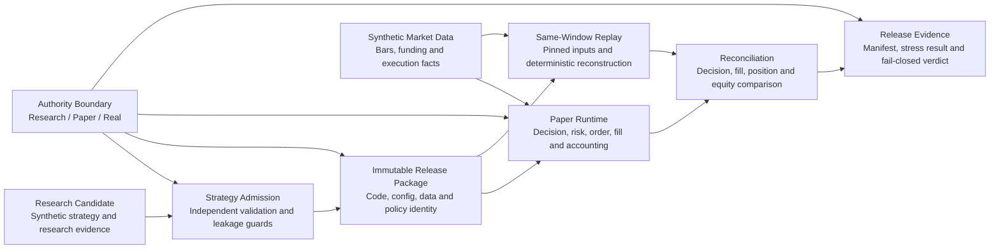

# QuantEngine Public v2: Public Architecture and Build Design

Status: design v1  
Scope: public, synthetic, runnable reference implementation  
Relationship to private work: architecture extraction, not a source-code mirror

## 1. Product Thesis

QuantEngine Public v2 demonstrates how a quantitative strategy candidate moves
from research evidence to a bounded Paper run and a fail-closed release verdict.
The trading engine is one part of that story. The public value is the complete,
auditable chain:

```text
candidate -> admission -> immutable package -> Paper runtime
          -> same-window replay -> reconciliation -> release evidence
```

The repository must answer three questions with executable evidence:

1. What exact strategy package and inputs were evaluated?
2. Did Paper and replay preserve the same trading and accounting semantics?
3. Is the evidence complete enough to permit the next bounded action?

This is a quantitative trading system. It is not a payment-system sample, an
exchange bot, a strategy marketplace, or a production deployment toolkit.

## 2. README Architecture Diagram

The following Mermaid diagram is the required primary architecture diagram for
the v2 GitHub README. A generated static SVG may be added as a fallback, but the
Mermaid source remains version-controlled and reviewable.



The README must place this diagram before the quick start. Every node in the
diagram must link to runnable code, a generated artifact, or a concise contract
document. Aspirational nodes are not allowed in the published diagram.

### 2.1 Architecture ownership boundary

The public repository owns the closed loop from candidate admission through the
release verdict, but it does not pretend to contain the complete private
ecosystem:

- research systems produce a candidate and evidence; they do not approve it;
- admission verifies the candidate and may refuse it; it does not run Paper;
- package materialization creates identity and authority; it does not change the
  strategy;
- Paper and replay independently produce facts from the same sealed package;
- reconciliation compares facts; it does not repair them;
- the release gate judges evidence completeness; it does not deploy or promote.

QuantLab, private strategy repositories, external Quality Shield services and
production operations remain outside the public implementation. Their public
interfaces are represented only by synthetic input or evidence contracts where
the end-to-end demo requires them.

### 2.2 Identity chain

The v2 architecture treats identity as an end-to-end chain, not one manifest at
the end of a run:

```text
candidate identity
  -> admission-policy and dataset identity
  -> release-package identity
  -> runtime and input identity
  -> decision/action/order/fill identity
  -> ledger and reconciliation identity
  -> release-verdict identity
```

Every downstream artifact references the exact upstream identity it consumed.
No stage may infer equivalence from a filename, mutable directory, shortened
digest or user-supplied claim.

## 3. Public Capability Slices

### 3.1 Research candidate

The demo begins with a deliberately simple synthetic strategy candidate. The
candidate contains no proprietary alpha logic. It exists to demonstrate
identity, time boundaries and evidence flow.

Public contract:

- candidate ID and schema version;
- pinned synthetic dataset identity;
- declared research and validation windows;
- public risk and execution assumptions;
- expected evidence inventory.

### 3.2 Strategy admission

Admission is an independent verifier, not a result declared by the candidate.
It must reject:

- overlapping or future validation windows;
- incomplete dataset identity;
- missing benchmark or policy identity;
- a candidate whose material changes after validation;
- a request to acquire Paper or Real authority by self-declaration.

The public implementation demonstrates the boundary and verification semantics,
not a private research process or production strategy-selection policy.

### 3.3 Immutable release package

An admitted candidate is materialized into a self-contained package:

```text
release-package/
  strategy.json
  portfolio.json
  runtime_dependencies.json
  admission_result.json
  release.lock.json
  package.manifest.json
```

The manifest binds every material file by SHA-256. Changing code, configuration,
data identity, execution policy or authority invalidates the package.

Research and Paper packages are distinct identities. Retargeting a package is a
new operation with a new manifest and explicit `paper_allowed` authority. The
public system never grants `real_allowed` execution authority.

### 3.4 Paper runtime

The synthetic Paper runtime implements one explicit semantic chain:

```text
market event -> decision -> risk check -> execution intent
             -> order -> fill -> position -> accounting ledger
```

Required properties:

- forward-only event time;
- idempotent event and fill handling;
- explicit order-state transitions;
- fills, not strategy claims, own realized trading economics;
- fees, slippage and funding are applied once at their declared boundaries;
- unsupported or ambiguous facts fail closed;
- every decision, order, fill and ledger entry carries run and package identity.
- runtime actions preserve a stable identity from decision through order and
  accounting, including retries and recovery.

No real exchange adapter, credential, order or account is included.

### 3.5 Same-window replay

Replay reconstructs the same declared window from pinned synthetic inputs. It
must not silently fill missing market or auxiliary data. Bars, funding inputs and
execution facts have independent identities and coverage receipts.

Replay is deterministic for the same package, input set and runtime policy. It
produces its own evidence rather than copying Paper output.

### 3.6 Reconciliation

Reconciliation compares Paper and replay at multiple semantic layers:

- eligible decision opportunities;
- decisions and execution intents;
- orders and confirmed fills;
- positions and lifecycle transitions;
- realized and unrealized PnL;
- fees, funding, cash and final equity;
- package, input and runtime identity.
- the decision/action chain connecting execution facts to their originating
  strategy decision.

Missing evidence is a named gap and produces `FAIL_CLOSED`. Tolerance is allowed
only where a public policy explicitly defines it; tolerance never repairs
missing identity or missing rows.

### 3.7 Stress, recovery and release evidence

The demo includes bounded synthetic fault scenarios:

1. duplicate market event;
2. duplicate fill delivery;
3. interruption between fill persistence and accounting projection;
4. package identity drift;
5. missing replay input coverage;
6. Paper/replay economic mismatch.

Recovery is accepted only when the system can replay idempotently and produce a
complete reconciliation result. Restart success alone is not recovery evidence.

The final gate consumes artifacts and emits either `PASS` or `FAIL_CLOSED`. It
does not merge code, deploy a service, start Real trading or move capital.

## 4. End-to-End Public Demo

One narrow entry point runs the reference scenario. It is not a workflow DSL or
a super-CLI.

The primary clean-checkout invocation is:

```bash
python -m quantengine_public.demo --artifact-dir artifacts/demo-v2
```

The installed console entry may provide the same `demo-v2` operation, but the
module entry point remains the stable documented path. The demo accepts only an
output directory and a built-in scenario name. It does not accept commands,
steps, plugins, Python expressions, authority flags or arbitrary file reads.

```text
synthetic candidate
  -> independent admission
  -> immutable Paper package
  -> Paper event execution
  -> same-window replay
  -> reconciliation
  -> stress/recovery checks
  -> release verdict
```

Expected artifact directory:

```text
artifacts/demo-v2/
  input_manifest.json
  strategy_admission.json
  package.manifest.json
  paper_events.jsonl
  paper_ledger.jsonl
  replay_result.json
  reconciliation.json
  stress_report.json
  recovery_receipt.json
  release_verdict.json
```

The demo passes only when every artifact exists, every digest can be recomputed,
Paper and replay reconcile, fault scenarios produce their expected outcomes, and
the final verdict references the exact evidence set.

### 4.1 Fixed reference scenario

The first v2 release intentionally uses one small, inspectable scenario:

- one synthetic symbol named `QEP-USD`;
- one transparent moving-average candidate used only to create decisions;
- declared, non-overlapping research and validation windows;
- one entry intent with partial fills, one synthetic funding event and one exit;
- a final flat position with independently calculable cash and equity;
- a duplicate-event recovery injection that must not change the economics.

Fixture timestamps and IDs are fixed. Expected economics are calculated by a
small independent test oracle, not copied from runtime output. Richer strategies,
multiple symbols and exchange behavior are outside the v2.0 reference scenario.

### 4.2 Stress scope

The portable stress scenario expands synthetic events deterministically and
checks identity, idempotency, ordering and final economics. It reports elapsed
time, event rate and peak memory when available, but v2.0 does not claim a
production throughput number from heterogeneous GitHub runners. CI gates the
declared correctness invariants and a deliberately generous timeout, not a
marketing benchmark.

### 4.3 Reader path

The README follows this order:

1. one-sentence system claim;
2. primary architecture diagram;
3. five-minute demo command and expected final verdict;
4. architecture-node mapping table;
5. success and failure walkthroughs;
6. public/private boundary and threat model;
7. deeper design documents.

The mapping table has one row per architecture node with links to its contract,
implementation, output artifact and primary tests. A node without all applicable
links is removed from the public diagram rather than described as future work.

## 5. Target Repository Structure

```text
src/quantengine_public/
  contracts/          # Closed-world public schemas and identity helpers
  admission/          # Independent candidate validation
  packages/           # Immutable release-package materialization
  runtime/            # Synthetic Paper runtime
  orders/             # Order and fill lifecycle
  accounting/         # Position, cash and equity ledgers
  replay/             # Deterministic same-window replay
  reconcile/          # Layered Paper/replay comparison
  recovery/           # Idempotent recovery checks
  gates/              # Evidence-completeness and release verdicts
  demo.py              # One fixed end-to-end reference scenario

examples/v2/
  candidate/
  market_data/
  expected/

schemas/
docs/
tests/
```

Handlers and policies are ordinary typed code. Configuration may supply data,
thresholds and identities, but it cannot provide commands, executable steps,
plugins or new authority.

## 6. Private-to-Public Extraction Rules

The implementation is written as a clean synthetic reference. Private source is
not copied and scrubbed after the fact.

Public abstractions may preserve these engineering semantics:

- research/Paper/Real authority separation;
- immutable package and runtime identity;
- causal, same-window replay;
- order/fill/accounting ownership boundaries;
- fail-closed reconciliation;
- evidence-bound release decisions;
- bounded stress and recovery verification.

The repository must not contain:

- real strategy logic, parameters or portfolio composition;
- private datasets, market captures or observed account results;
- exchange adapters or credentials;
- real orders, fills, balances, positions or capital values;
- private repository paths, task records, hostnames or deployment topology;
- production configuration, scripts or operational commands;
- local-model, Qwen or Studio implementation details;
- automatic Real promotion, deployment or capital authority.

Before publication, tracked files and Git history must pass an explicit secret,
private-path, hostname, account-data and strategy-material scan.

### 6.1 Synthetic-data rules

Public fixtures must be generated for this repository and visibly marked
`synthetic`. They may not be sampled, rounded, anonymized or translated from a
real account, strategy, incident or market capture. Example IDs, symbols,
capital values, timestamps and performance results must not resemble internal
identities or be presented as observed trading performance.

Generated artifacts must use repository-relative logical paths. They must not
record the developer's home directory, workstation name, container name,
network address or environment-specific temporary path.

### 6.2 Public threat model

The implementation and tests must cover at least these attacks:

- omission: a required material or artifact is absent from a manifest;
- substitution: a valid artifact from another package or run is inserted;
- mutation: a bound file changes after admission or execution;
- truncation: a short digest or partial identity is treated as authoritative;
- path escape: a manifest references content outside its package root;
- self-judgment: replay consumes Paper output instead of producing independent
  facts;
- evidence laundering: a prior PASS is reused after inputs or policy change;
- authority injection: fixture or configuration attempts to enable Real;
- nondeterminism masking: volatile timestamps or ordering hide semantic drift.

The public release gate must verify manifest completeness and recompute digests
from bytes. It must not trust a PASS string, process exit code or artifact path
supplied by the run under judgment.

### 6.3 Publication checklist

Before a public commit or release:

- scan tracked files and the commits introduced by the v2 branch;
- reject absolute paths, hostnames, account-like identifiers and secret forms;
- inspect generated artifacts before adding them as examples;
- verify every dependency and bundled asset is license-compatible;
- build from a clean checkout without private environment variables;
- confirm the package has no network or exchange requirement;
- confirm every Real authority field is absent or hard-false and cannot be
  overridden by input.

## 7. Implementation Phases

### P0: public boundary and baseline

- tag the current May implementation as the v1 baseline;
- remove payment-domain wording from the v2 line;
- add public schemas and fixtures before feature code;
- document the extraction and redaction inventory;
- add leak and absolute-path checks to CI.
- add manifest substitution, path-escape and authority-injection attacks to CI.

### P1: identity, admission and package

- implement the synthetic candidate contract;
- implement independent admission failures;
- materialize an immutable Research/Paper package;
- prove every material mutation invalidates prior evidence.

### P2: Paper, replay and accounting

- implement the forward-only Paper semantic chain;
- persist decisions, orders, fills, positions and ledger rows;
- replay the same pinned window independently;
- make fill-based economics and idempotency load-bearing in tests.

### P3: reconciliation, stress and recovery

- compare Paper and replay at every declared semantic layer;
- implement the six bounded fault scenarios;
- prove restart, replay and recovery do not duplicate economics;
- emit named evidence gaps and fail closed.

### P4: GitHub public release

- put the v2 Mermaid architecture diagram in the README;
- add a five-minute walkthrough and failure walkthrough;
- publish schemas, expected artifacts and threat model;
- run tests and the full demo in GitHub Actions;
- publish versioned artifacts and a v2 release note.
- tag the final design as the implementation scope and keep future ideas in a
  separate roadmap section below the shipped architecture.

## 8. Acceptance Criteria

QuantEngine Public v2 is complete only when:

1. a new reader can explain the architecture from the README diagram;
2. a clean checkout can run the complete demo without private dependencies;
3. the same inputs produce byte-stable deterministic artifacts where declared;
4. modifying any bound package material invalidates the verdict;
5. Paper and replay are independently produced and fully reconciled;
6. duplicate events and recovery do not duplicate orders, fills or economics;
7. missing identity or evidence always returns `FAIL_CLOSED`;
8. every README architecture node maps to implemented code and tests;
9. CI runs the success path, failure paths and public-safety scan;
10. no private or production material appears in the repository or its release.
11. the public threat-model attacks fail for their intended, named reasons;
12. a clean build and demo run require no network, private variables or local
    machine identity.
13. the fixed reference scenario can be understood by inspecting fewer than 20
    input events and its arithmetic can be independently checked;
14. the README maps every architecture node to code, artifacts and tests;
15. stress output is labeled as a reproducible demonstration, not production
    trading-performance evidence.

## 9. Review Plan

The design receives three review-and-revision passes before implementation:

1. **Architecture fidelity:** compare the public chain with current QuantEngine
   boundaries without importing compatibility debt or private implementation.
2. **Security and truthfulness:** attack the redaction boundary and remove claims
   that cannot be demonstrated by public code and artifacts.
3. **Reader experience and buildability:** verify that an external engineer can
   understand, run and inspect the system without internal context.

Each review must record findings, decisions and concrete document changes. The
approved design becomes the scope contract for implementation.
